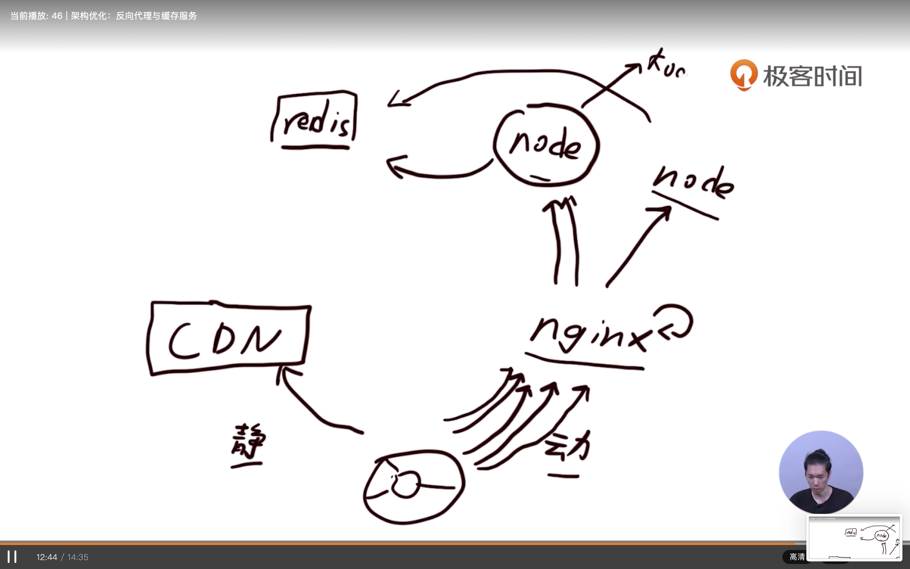

# node多进程

## node多进程优化

### 进程和线程

> 什么是进程，什么是线程？

- 进程
  - 就是操作系统挂载运行程序的单元，
  - 进程拥有一些独立的单元如内存等。
- 线程
  - 是进行运算调度的单元
  - 进程内的线程共享进程内的资源

- 进程和线程。
  - 进程类似于公司
  - 线程类似于公司的‘职员’

> node.js事件循环

- node.js就是一个进程
- 主线程运行V8与js
- 多个子线程通过事件循环被调度

> node.js子进程与子线程，以利用更多的CPU

- 集团（多进程）-分公司（子进程）- 分公司职员（子线程）

### cluster模块, 提供多进程的能力。

> [Node-内置模块：集群 cluster](https://blog.csdn.net/zhq2005095/article/details/81018366)

- master主进程不负责具体的业务，而是监控和协调worker进程的运行。
- worker工作进程负责负责具体的业务处理,worker进程之间的通讯采用进程间通讯（IPC）交换信息
- 子进程之间能够共享监听同一端口。

### node.js进程守护与管理

- [node.js进程守护神forever](https://github.com/foreversd/forever)

> 多进程优化（代码参见Node.js开发实战- 44多进程优化，进程守护与管理）

## node架构优化（需要购买 云服务器）

### 架构优化之动静分离

- 静态内容（脚本、样式文件、图片等）
  - 原理：基本不会变动，也不会因为请求参数不同而变化
  - 实现方式：CDN加速分发，在http服务包 response的header里面使用cache-control的缓存（no-store, public(private/nocache), max-Age, no-transform ）
- 动态内容
  - 原理：各种因为 请求参数不同而变化，且变种的数量几乎不可枚举
  - 实现方式：用大量的源站机器承载，结合反向代理进行负载均衡。

### 架构优化之 Nginx反向代理（包含Nginx缓存和负载均衡）和redis缓存

- 
- 在Nginx反向代理的情况下，从客户端到Nginx, Nginx会做一层缓存，然后由Nginx到node层获取数据。在node层同样的可以用redis来做动态内容的缓存。经过Nginx和redis这两层的缓存处理（也就是用内存空间换取时间的方法），最后需要node层（koa或者express框架）处理的数据就比较少了，从而达到node服务架构优化的目的
