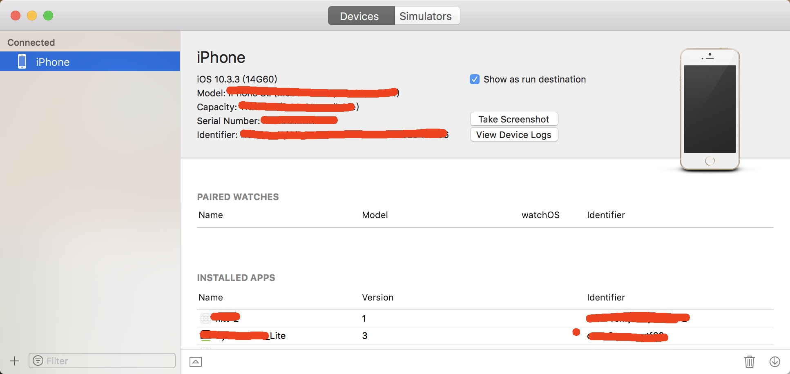
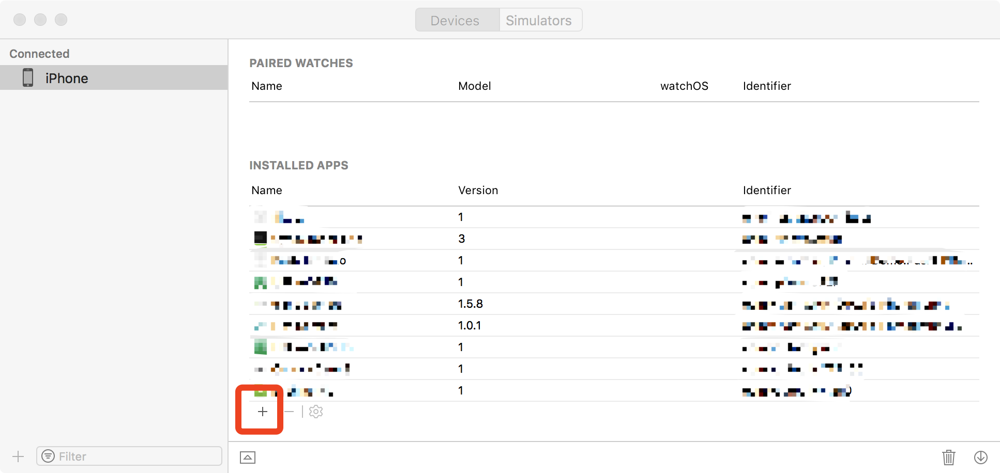

# Charles

> 关于抓包工具的运用，可以参考这样的一篇文章
- [文章参考](https://blog.csdn.net/liuwkk/article/details/81258522)

> Charles的破解版下载
- [Charles 教程](https://www.axihe.com/tools/charles/charles/tutorial.html)

> 利用Charles 的 Map Local 功能  mack 数据。

- 你想要什么数据，就修改什么数据。
  - 特别是某些数据需要后端那边各种配置的时候，比如存款加息券的数据配置。这种时候特别方便。

## iphone怎么安装ipa包

> [怎么样在MAC上快速的安装ipa包](https://my.oschina.net/1715828751/blog/1632166)

- 有时候需要将mac上 的debug包  下载到 测试iPhone 真机上。我们就可以这么做。

MAC上安装
以前MAC 电脑上用iTunes 是可以直接安装的，现在不能这样安装了。现在有种新的安装方法要借助Xcode工具

Xcode —> windows —> Devies And Simulators.

选择Devices, 将手机连接到MAC 电脑上。就会出现如图所示情景。

- 

将整个界面忘下滑动，即可出现如图所以的添加按钮。

- 

点击之后选中即可。