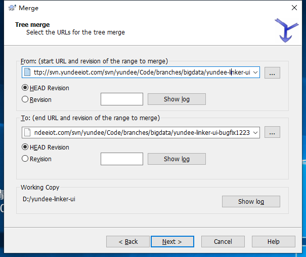

# SVN 详细步骤

- [SVN Merge 操作](https://blog.csdn.net/wenwen111111/article/details/54924498)
- [怎么删除 svn 上已上传的文件](https://blog.csdn.net/liusl1987/article/details/19627915)

> 把代码拉下来

- 鼠标右键 点击 SVN checkout, 在第一个下拉框里面输入远程仓库地址
- 

> 新建分支

- Branch/tag... 注意分支的命名：
- 一定是要平行的关系，比如 branch01: AA/BB/CC/project; branch02: AA/BB/CC/project-bugfix1223。
- 而不是 branch01: AA/BB/CC/project; branch02: AA/BB/CC/project/bugfix1223
- 

> 切换分支

- Switch
- 

> 在新分支中 开发代码, 然后提交代码到远程服务器

- 点击左侧面板的+号，就能够把 unversioned 的文件提交添加到本地版本控制 将项目所有文件添加到本地版本控制
- 在终端（TERMINAL）中输入 svn commit -m 'test SVN' 提交本地项目到远程服务器
- 

> 将自己本地开发分支的代码 合并到 主分支上

- Switch 将分支切换到 主分支
- 
- 鼠标右键选择 merge -> 选择 merge two different trees -> 点击 next 按钮
- 
- From 输入框里面选择 主分支 （也就是老的代码）
- To 输入框里面选择 本地开发分支（也就是最新的开发代码）
- 
- 点击 next -> 点击 Test merge -> 测试通过的话 -> 点击 merge 按钮
- 
- **最后不要忘了**commit 一下 svn commit -m 'test'

> 将主分支上的代码 合并到 当前开发分支

- Switch 将分支切换到 主分支， 并且记得 Update
- 然后就是 与 自己本地开发分支的代码合并到主分支上 是一样的操作手法，不同点就是：
- From 输入框里面选择 本地开发分支（也就是老的代码）
- To 输入框里面选择 主分支（也就是最新的开发代码）

> 怎么删除分支

- 右击已经存在的 SVN 项目->repo browser,弹出框的左边选择需要删除的分支右击->delete
- 一定不要手动删除文件
- 

> 怎么删除当前分支中的某个文件

- 先在传错传文件的当前目录下点击鼠标右键，选中 TortoiseSVN，在右边下拉框选中版本库浏览器，从版本库浏览器列表中选出目标文件，选中目标文件，右键下拉框，删除。
- 
- 
- 然后在 vscode 里面 最下方点击 分支刷新按钮，就可以做到当前分支文件的完全删除了。
- 

> SVN 在 vscode 中提交流程

> 当新建了一个 branch 的时候，当有文件新增的时候，此时我们应该

- 点击左侧面板的+号，就能够把 unversioned 的文件提交添加到本地版本控制 将项目所有文件添加到本地版本控制
- 在终端（TERMINAL）中输入 svn commit -m 'XXX' 提交本地项目到远程服务器
