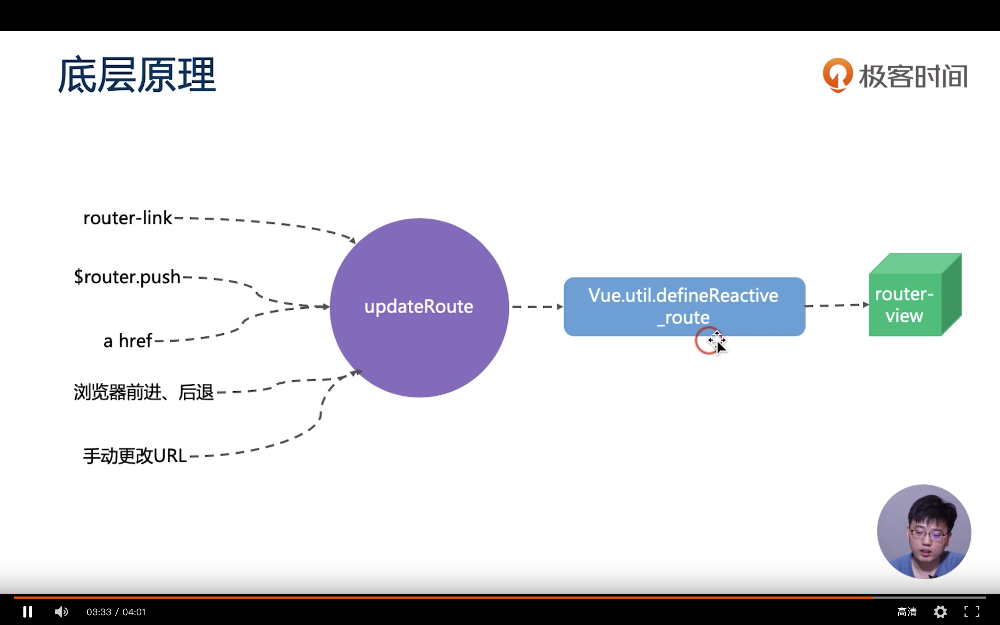

### VueRouter

> history 模式 / hash 模式

- History 模式

  > History 模式下，后端需要如何配合？正常情况，我们访问 www.xxx.com 后端会定位到 index.html, 但如果访问 www.xxx.com/vue 二级目录、三级目录时，也需要后端配合定位到 index.html

  > history 模式，需要让后端把所有路径都指向 index.html，hash 模式则没有这个刚需，只要一个跟路径指向 index.html 即可，剩下的直接 404

- hash 模式

  > hash 模式 丑，在这种模式下不能使用锚点定位。

  > 在 hash 模式下，就只需要后端将根路径指向 index.html 即可。

> VueRouter 底层原理

- router-link \$router.push a href 浏览器前进、后退 手动更改 URL,这些都会触发 updateRouter。
- 由 updataRouter 里面去调用 Vue.util.defineReactive_route 从而更改响应式数据，通过 Vue.util.defineReactive_route 这个 API 将 路由变成了一个响应式的。
- router 响应式数据改变了之后，就会自动去触发 router-view 的更新，router-view 里面 会根据 url 的改变去更新我们的组件。
