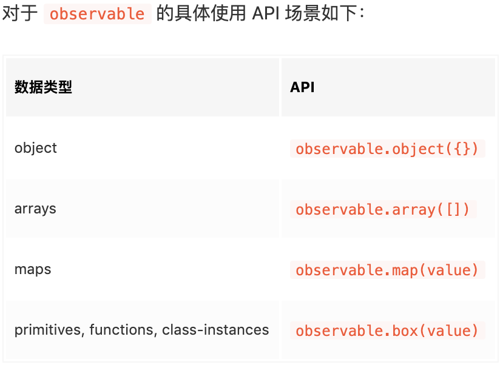

# Mobx在react(或者 react Native) 中的运用

### 参考文档

> [Mobx React 初学者入门指南,这是一篇好文章](https://juejin.im/post/5cc3d28df265da036b4a6c0f)

> 总体逻辑

- 数据流向是 UI => action => state. UI不直接修改state, 而是通过派发action修改state
- 当state改变的时候，会通知所有的observers观察者。
  - 其中UI是<b>最重要<b>的观察者，通常还会有其他的观察者。
  - 其他的观察者被称为 side effects, 也被称作reactions. 其中autorun就是这样的一种观察者，它会自动观察函数里面的obserable变量
- action 和 reaction（或者 side effects） 的区别
  - action 是用来改变state状态的，而reaction是state改变后需要去执行的
  - 也就是说 action => state => reaction， 动作改变状态，状态引起反应

> Observables , Actions , Reactions(包含ES5 和 ES6的写法)

- Observables.  在ES6中，使用装饰器的形式来使用我们的Mobx, 不仅仅是@observable


```js
//observable提供了如下的API， 在ES5中的表达是这样的
const cart = observable.object({
    items: [],
    modified: new Date(),
    get description() {
        switch (this.items.length) {
            case 0:
                return 'no items in the cart';
            default:
                return `${this.items.length} items in the cart`;
        }
    }
})

// 在ES6中的表达是这样的
class Cart {
    @observable.shallow items = []; // => observable.array([], { deep: false })
    @observable modified = new Date();
    @observable name = 'Hero'; // 名字
    @observable blood = 100; // 血量
    @observable magic = 80; // 魔法值
    @observable level = 1; // 等级
    @computed get description() {
        switch (this.items.length) {
            case 0:
                return 'no items in the cart';
            default:
                return `${this.items.length} items in the cart`;
        }
    }
    @action
    addItem = () => {
        this.items.push('new one');
    }
}

```

- reactions(也被称作 side effects).  Mobx三种reactions: autorun()、 reaction()、when()
- 详细的这三种reactions的代码，请参考文章

```js
// autorun()
import { observable, action, autorun } from 'mobx';

class Cart {
    @observable modified = new Date();
    @observable.shallow items = [];

    constructor() {
        this.cancelAutorun = autorun(() => {
            console.log(`Items in Cart: ${this.items.length}`); // 1. 控制台输出: Items in Cart: 0
        });
    }

    @action
    addItem(name, quantity) {
        this.items.push({ name, quantity });
        this.modified = new Date();
    }
}

const cart = new Cart();
cart.addItem('Power Cable', 1); // 2. 控制台输出: Items in Cart: 1
cart.addItem('Shoes', 1); // 3. 控制台输出: Items in Cart: 2

cart.cancelAutorun();

cart.addItem('T Shirt', 1); // 控制台不输出
```

```js
//reaction()
import { observable, action, reaction, toJS } from 'mobx';

class ITOffice {
    @observable members = []
    constructor() {
        reaction(() => {
            const femaleMember = this.members.find(x => x.sex === 'female');
            return femaleMember;
        }, femaleMember => {
            console.log('Welcome new Member !!!')
        })
    }
    @action addMember = (member) => {
        this.members.push(member)
    }
}

const itoffice = new ITOffice();

itoffice.addMember({
    name: 'salon lee',
    sex: 'male'
});

itoffice.addMember({
    name: 'little ming',
    sex: 'male'
});

itoffice.addMember({
    name: 'lady gaga',
    sex: 'female'
}); // 1. 控制台输出: Welcome new Member !!!
```

```js
 // when() 和 reaction() 类似，都有个前置判断函数，但是 when() 返回的是布尔值 true/false。只有当 predicate-function 返回 true 时，effect-function 才会执行，并且 effect-function 只会执行一遍。也就是说 when() 是一次性副作用，当条件为真导致发生了一次副作用之后，when() 便自动失效了，相当于自己调用了 disposer-function 函数。
```

> Mobx React

- 在react里面如何使用mobx 呢

```js
//首先安装mobx-react库， 然后用 observer 连接 react 组件 和 mobx 状态
npm install mobx-react --save
//1.创建购物车vm , CartStore.js
import { observer } from "mobx-react";
export default class Cart {
    @observer modified = new Date();
    @observer.shallow items = [];

    @action
    addItem = (name, quantity) {
        while (quantity > 0) {
            this.items.push(name)
            quantity--;
        }
        this.modified = new Date();
    }
}
//2.将购物车状态state 通过Provider 注入到上下文当中,   index.js
import { Provider } from 'mobx-react';
import store from './CartStore'

ReactDOM.render(
    <Provider store={new store()}>
        <App />
    </Provider>,
    document.getElementById('root')
);

//3. 然后在其他组件文件里通过 inject 将 store 注入到 props  app.js
import React from 'react';
import './App.css';
import { inject, observer } from 'mobx-react';

@inject('store')
@observer
class App extends React.Component {
  render() {
    const { store } = this.props;

    return (
      <React.Fragment>
        {store.items && store.items.map((item, idx) => {
          return <p key={item + idx}>{item + idx}</p>
        })}
        <button onClick={() => store.addItem('shoes', 2)}>添加2双鞋子</button>
        <button onClick={() => store.addItem('tshirt', 1)}>添加1件衬衫</button>
      </React.Fragment>
    );
  }
}

export default App;

```

### 一个简单的例子

```js
import React from 'react';
import ReactDOM from 'react-dom';  
import { observable, action } from 'mobx';  
import { Provider, observer, inject } from 'mobx-react';

class CounterModel {  
    @observable
    count = 0

    @action
    increase = () => {
        this.count += 1;
    }
}

const counter = new CounterModel();

@inject('counter') @observer
class App extends React.Component {  
    render() {
        const { count, increase } = this.props.counter;

        return (
            <div>
                <span>{count}</span>
                <button onClick={increase}>increase</button>
            </div>
        )
    }
}

ReactDOM.render(  
    <Provider counter={counter}>
        <App />
    </Provider>
);
```

### 一个shizhan的例子

> 在demoScreen.js里面，运用了mobx-react里面的observer 和 Observer

- observer 对应的 @observer 运用在 demoScreen 组件上

- Observer 作为一个可观察的组件，里面包裹一个函数。这样函数里面的return 组件<ZAScreenComponent />也是可观测的

```js
// demoScreen.js

import React, { Component } from 'react'
import {
  StyleSheet,
  View,
  Text,
  ImageBackground,
  Image,
  TouchableOpacity,
  Dimensions,
  Platform,
  Alert,
  Keyboard
} from 'react-native'
import demoVM from '../viewModal/demoVM'
import { observer, Observer } from 'mobx-react'

@observer
export default class demoScreen extends Component {
  constructor (props) {
    super(props)
    this.newVM = new demoVM()
    this.state = {
    }
  }

  componentDidMount () {
    this.newVM.componentDidMount(this)
    if (Platform.OS === 'ios') {
      setTimeout(() => { this.keyboardWillHideListener = Keyboard.addListener('keyboardWillHide', () => { this.newVM.BBB = true }) }, 0)
    } else {
      setTimeout(() => { this.keyboardDidHideListener = Keyboard.addListener('keyboardDidHide', () => { this.keyboardDidHideAndroid() }) }, 0)
    }
    // 监听页面消失
    this.willBlurSubcription = this.props.navigation.addListener(
      'willBlur',
      payload => {
        console.log('demoScreen willBlur')
        this.newVM.showDepositModal = false
      }
    )

    this.newVM.AAA(this.newVM.ddd).then((response) => {
    }).catch(error => {
      ZAErrorUtils.handleError(error)
      this.newVM.GGG = Layer.CONTENT
    })
  }

  componentWillUnMount () {
    if (Platform.OS === 'ios') {
      this.keyboardWillHideListener && this.keyboardWillHideListener.remove()
    } else {
      this.keyboardDidHideListener && this.keyboardDidHideListener.remove()
    }
    // 移除监听
    this.willBlurSubcription.remove()

    this.newVM.componentWillUnMount()
  }

  keyboardDidHideAndroid () {
    this.newVM.BBB = true
  }

  renderMyView () {
    const { ddd = 'HKD', demo1Data } = this.newVM
    const CCC = this.newVM.demoData.filter((item) => item.bondSelected === true)
    const { bondSelected = false, isBondDisabled = false, couponNumber } = CCC[0] || {}
    const DDD = bondSelected && !isBondDisabled ? couponNumber : '0'
    const { interest = '0.00' } = this.newVM.depositTrailResult || {}
    const demo2Data = this.newVM.fixedListData.filter((item) => item.selected === true)
    const { yearRate = '0' } = demo2Data[0] || {}
    const FFF = this.newVM.mmm(Number(DDD), Number(yearRate))
    return (
      <View>
      </View>
    )
  }

  render () {
    return (
      <Observer>
        {
          () => {
            return (
              <ZAScreenComponent
                ref={(v) => { this.myScreen = v }}
                navigation={this.props.navigation}
                style={styles.container}
                goBackAction={() => {
                  setTimeout(() => {
                    this.newVM.reset()
                    this.props.navigation.pop()
                  }, 900)
                }}
                inputAccessoryView={
                  <View>
                    {this.newVM.BBB ? <ZAProcessButton
                      source={theme.image.ICO_right}
                      title={ZAI18n.t('dict_266_1004592')}
                      onPress={() => this.onDepositPress()}
                      style={styles.depositButton}
                    /> : null}
                    {this.newVM.BBB ? null : <View style={styles.finishedButtonLayout}>
                      <TouchableOpacity onPress={() => this.finishedImportText()}><Text style={styles.finishedButtonText}>{ZAI18n.t('dict_266_1006498')}</Text></TouchableOpacity>
                    </View>}
                  </View>
                }
                GGG={this.newVM.GGG}
              >
                { this.renderMyView() }
                <ZANormalAlert />
              </ZAScreenComponent>
            )
          }
        }
      </Observer>
    )
  }
}

const styles = StyleSheet.create({
  XXX: {
    flex: 1,
    backgroundColor: 'white'
  }
```

> demoVM.js里面，运用了mobx的 observable、action、computed

- observable 对应的 对demo01变量的 可观察化。 @observable demo01 = Hac.aaa
- action 对应的 ccc方法 的可观察化。  @action async ccc (ddd) {}
- computed 对应的 hhh属性的可观察化（基于 基础可观察属性的 计算）。  @computed get hhh () {}
  - 由基础的 state （比如 demo01 ）衍生出 computed

```js
// demoVM.js
import { observable, action, computed } from 'mobx'

class demoVM {
  @observable demo01 = Hac.aaa

  @action
  componentDidMount (demo03) {
    this.demo02 = demo03.props.navigation.getParam('bbb', 3)

    this.demo03 = demo03

    this.ccc(this.ddd)
  }
  @action
  componentWillUnMount () {
    // 重置数据源，否则下次进来数据源已有数据
    this.reset()
  }

  @action
  async ccc (ddd) {
    const params = {
      ddd,
      eee: '002',
      fff: 'TD000001'
    }
    const json = await ggg.fetchData(params)
    return json
  }

  @computed get hhh () {
    return false
  }

  mmm = (num1, num2) => {
    const ppp = (num1.toString().split('.')[1] || '').length
    const qqq = (num2.toString().split('.')[1] || '').length
    const sss = Math.pow(10, Math.max(ppp, qqq))
    return (num1 * sss + num2 * sss) / sss
  }

  // 重置界面状态
  @action
  reset () {
    this.demo01 = Hac.CONTENT  // 清空提示
  }
}

export default demoVM
```
