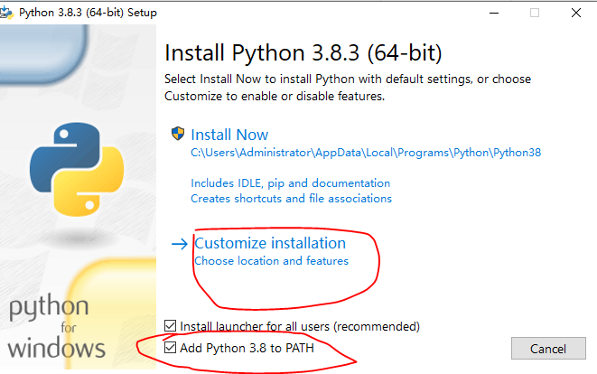
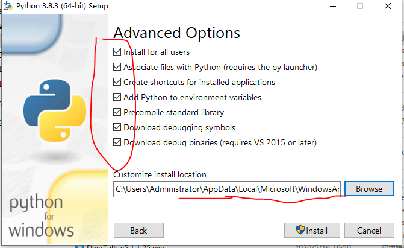
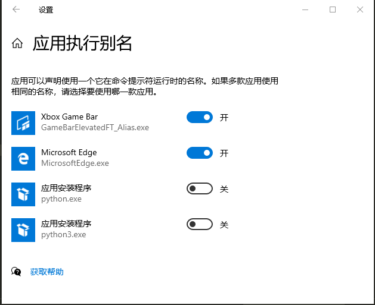
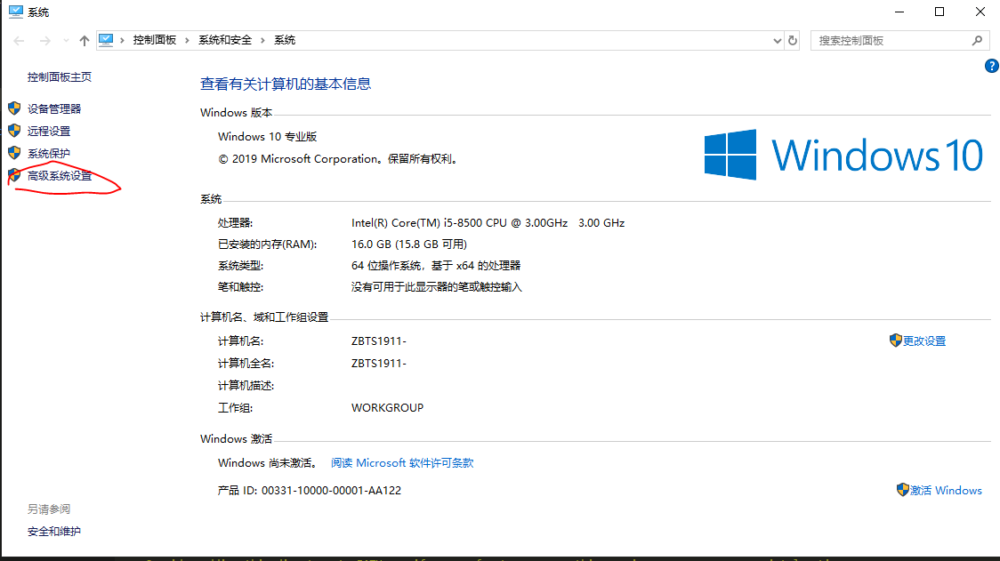
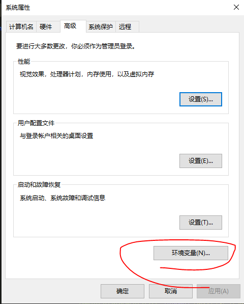
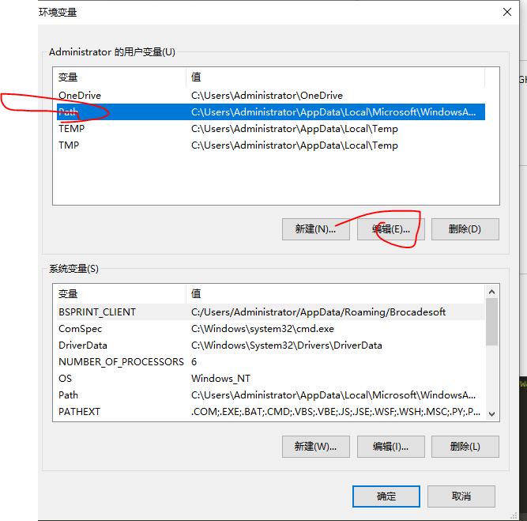

# python 的基础配置

## win10 下面怎么下载 python 到指定的目录

- 将 python 下载到 这个路径下 /c/Users/Administrator/AppData/Local/Microsoft/WindowsApps
- **下载的时候记得勾选配置环境变量**

- 
- 
- 

> 在左下角输入框里面 输入 管理应用执行别名

- 

> 查看 python -v

- 如果显示了版本，说明 python 安装位置是正确的

> 使用 python 的包管理工具 pip

- python -m pip install
- python -m pip install --upgrade pip

> win10 下面添加环境变量

- 比如 pip -v 的时候 没有添加环境变量的话 就会显示 bash: pip: command not found
- 怎么添加 环境变量？
  - 右键 我的电脑-属性
- 
- 
- 

## python 在 vscode 里面的配置

- 下载插件 python
- debug python 文件, debug 按钮
  - 点击 debug 展开面板后面的 Run and Debug
