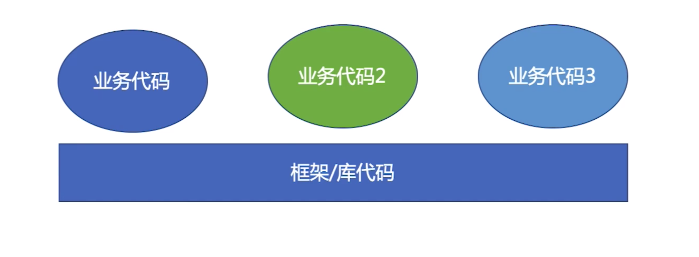

# serverless 和 koaless

## 什么是云函数

- 不用再因为运维、架构的事情操心
  - 缩短业务上线周期，
  - 减少出错的概率
  - 业务开发的上手难度更低
- 渐进式
  - 也就是说serverless其实也是渐进式开发。
  - 通过屏蔽服务器细节让你可以快速上手，但是如果你想深入的话，也是提供了相应的路径的。

> vue/react => domless

- 用vue/react写程序，一般不需要进行dom操作，这些dom操作的细节都被框架实现了
- 屏蔽DOM操作细节
  - 缩短功能上线周期
  - 减少出错可能性
  - 开发前端业务的上手难度更低

> jQuery => compatless

- 屏蔽浏览器兼容细节
  - 缩短代码编写周期
  - 减少出错可能性
  - 前端开发的上手难度更低

> 其他的编程语言

- Node.js => threadess
- JavaScript => typeless
- Java/C# => 内存管理less  相比于C++是自己管理内存，编写Java程序不需要自己来管理内存
- 可视化开发 => 编程less

## 什么是serverless （通过屏蔽细节less，让业务开发更容易）

> 把能在多个业务复用的东西下沉，屏蔽细节

- 
- 好的框架：把复杂的，通用的东西下沉（less化）-> 实现渐进式
  - 我们要做的细节：Node.js BFF层应用到大部分的业务
    - 快速扩展Node.js业务页面
    - 新人能不理会底层细节快速上手

## koaless

- 将koa框架 进行了封装，下沉到最底部

- 将数据层也进行封装，但不是一定要下沉到最底部，比如下沉到中间层，也是下沉，也能做到复用。
  - 屏蔽请求细节
  - 让新来的开发同学，能够更好的上手而不需要具体关注RPC 细节。
