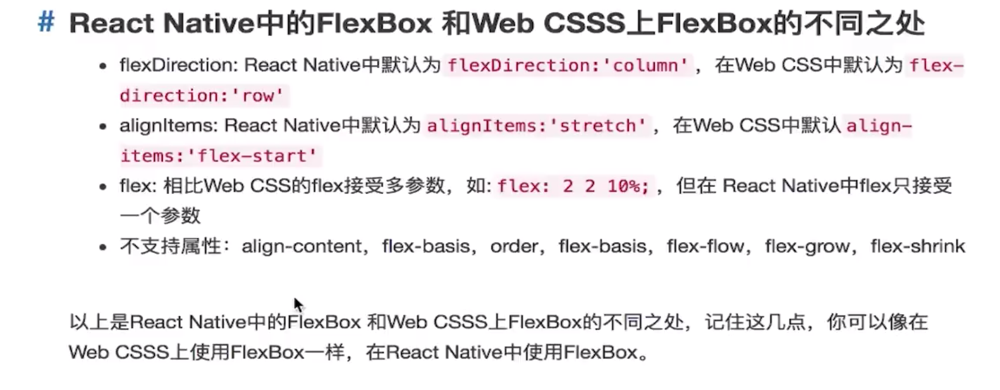

# React Native 实战

### React Native

- (资源汇总)[https://github.com/jondot/awesome-react-native]

### React Native 布局知识详解

> 在React Native 中尺寸是没有单位的，它代表了设备独立像素

> React Native 与 Web CSS 中 FlexBox 的区别

