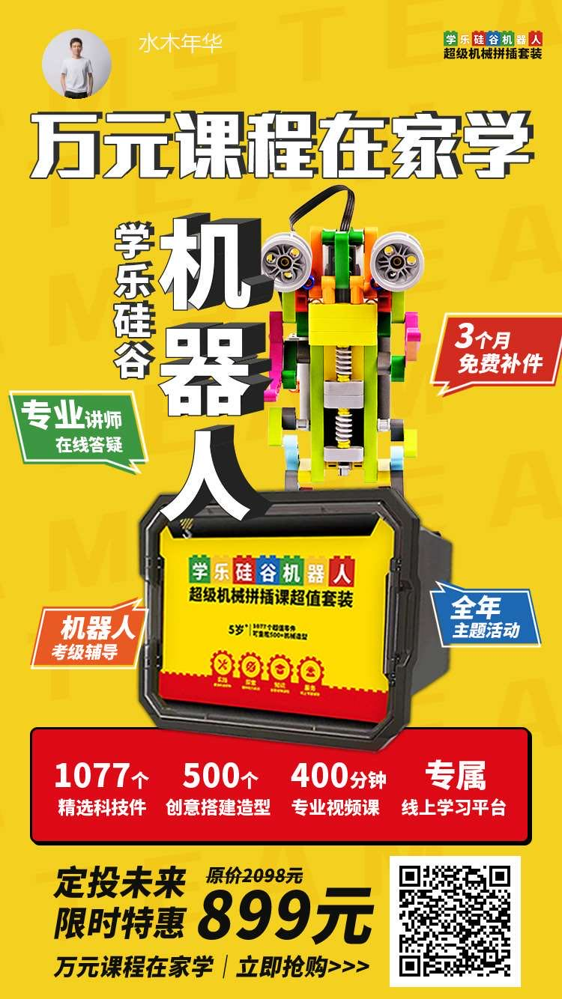

身处数字化的世界，现在的各种手机软件、比如抖音、直播软件、游戏软件之类的 都在抢占孩子的注意力。

让孩子能够健康的成长，不被过度的游戏或者娱乐耽误，应该是天下父母的心愿吧。

有些父母会对孩子说些这样的话：我们这辈子就这样了，孩子就指望你了，你要努力给爸妈争气。父母在打牌打麻将刷抖音，却强迫你身边的孩子好好学习天天向上，这是不是有点扯。父母都不想让孩子输在起跑线上，可是恰恰父母才是孩子的起跑线吧。

在孩子闲暇的时候，不是光想着拿起手机玩手机游戏刷抖音，我们的学乐硅谷机器人就可能适合你家的孩子。

> 在玩机器人的过程中，培养了孩子专注的能力。所谓板凳坐穿十年冷，能坐得住沉得下心，对孩子取得更好的学习成绩是相当重要的。

> 在玩机器人的过程中，肯定会有困难，遇到困难不畏缩，养成努力解决问题的心态。哪怕遇到困难也不用担心，学乐硅谷机器人里面有详细的搭建机器人示例，孩子也能够在学习中搭建完成。

> 拼装乐高机器人，也是让孩子从小了解数字世界编程的一种好方式，这是我想重点说明的。

众所周知，现在已经是数字世界了，手机不在身边就像是身体缺少了一部分一样，这样说绝不夸张，手机已经事实上成为了我们身体的一部分。而手机里面的软件都是用程序代码写成的。

那对于我们的孩子来说，他们从出生开始就沉浸在数字世界了，他们才是数字世界的原住民。

在过去的时间里，一般的人都会去考驾照学开车；在未来的世界，编程就像现在的驾驶一样，是人人都需要学习的技能。未来的编程可能不仅仅是一种职业了，就像学习开车一样，你学会开车不是想要你要从事驾驶职业，而是你的日常所需，因为不会开车在现代社会还是很不方便的。

说到编程的重要性，那么学乐硅谷机器人这类的玩具为什么也很有帮助呢？

首先编程中有一个思想就是组件化、模块化开发，就像建房子一样，房子的基础做好的话，3 天一层楼往上盖不是什么困难的事情；编程也是这样，把类似于梁板柱这样的模块做好，编程就是拼装组合各种模块，最终形成在现实世界可用的软件，从而极大的提高效率。

学乐硅谷机器人就是通过搭积木的方式，组装成各种机器人，模块化搭建机器人，恰恰是编程世界中一种很重要的方法论。

还有就是在编程中有一个 MVP 的概念，喜欢篮球看 NBA 的人都知道 MVP 是给篮球队员的一种荣誉，但在编程中 MVP 的意思就是 Minimum Viable Product（最小可用性产品），有了这个最小可用性产品，就相当于从 0 到 1，有了这个 1，以后从 1 到 100 到 10000 才有可能。这个 MVP 可以说是软件设计的重要理念。

现在对应着我们的学乐硅谷机器人，运用这个套装里面的模块，可以组件出相对简单的机器人，然后再这个基础之上不断的迭代升级，最终能造出更复杂的机器人。不是说一上来就要满分，先弄个及格分数，因为完成比完美更重要，不然一想到要达到那么完美的目标，我们的孩子可能连第一步都不会迈出去了。

说了这么多，至于学乐硅谷机器人的质量安全或者可玩性什么的，都是最最基本的要求。可以给孩子备上一套，让孩子劳逸结合，在玩机器人的过程中真正有所收获。

详细的产品信息可以扫描下面的二维码：

为了帮助到属于未来世界的孩子，聪明的父母可以送给孩子一些有益又好玩的东西。
