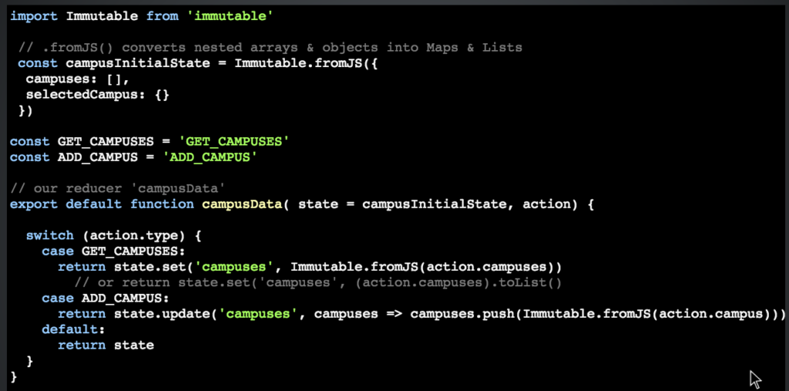
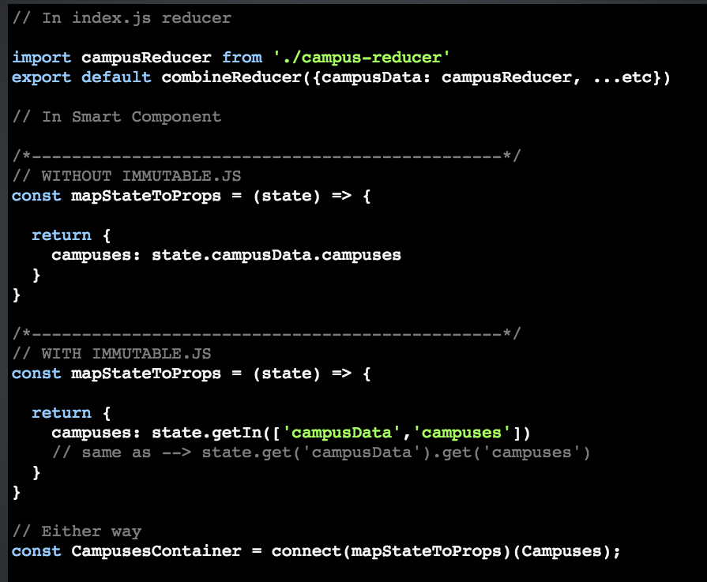

### What is Immutable

> 有一点需要注意的是：Immutable.js 既能 带来性能的优势，又能带来数据的可控性。  
> 在一些常规的项目中（比如ux-app），Immutable特性带来的数据的可控性比起性能来说更有优势.

> 首先有一点要明确的是： Immutable.js provides many Persistent Immutable data structures including: <b>List</b>, Stack, <b>Map</b>, OrderedMap, Set, OrderedSet and Record.
  原生 Object和Array是 mutable 的。其中Array对应着Immutable.js 里面的 List,Object对应着Immutable.js里面 的 Map。

  [immutable-js官方文档](https://immutable-js.github.io/immutable-js/)
[immutable相关的好文章](https://medium.com/@yej.arin.choi/this-is-a-post-that-summarizes-my-dive-into-immutability-in-programming-what-it-is-why-its-34cbba44f889)

明确两个概念： 值相等（传递）， 引用相等（传递）

> 对于值传递的数据结构，比如string、Number之类的，它们是immutable的数据结构；

> 对于引用传递的数据结构，比如普通的Array、Object之类的，它们是mutable的；

> 而immutable.js的目的，就是不会改变原引用类型的数据，因为immutable总是会create a copy of the old data structure, and change the data based on the created data structure instead of the old data structure.
  If you use Immutability, you are always creating a copy of the old data structure and applying the changes to the copy instead of changing the original data structure!
  现在的问题就是，既然是createing a copy of the old data structure, 如果原来的数据很多的话，那么这样copy 起来不是很费劲吗？  这就引出了<b>structural sharing</b>的概念

> 在react里面我怎么用  immutable.js 呢
   在深层嵌套的时候，用immutable.js 
 >> 不仅使代码写的更加优雅  
 >> 而且在深层嵌套的时候，使性能更好

#### 对比下面的两端代码

通过上面的两段代码，我们就能知道 知道  在<b>很深的嵌套</b>的情况下，用immutable写代码是多么的优雅。