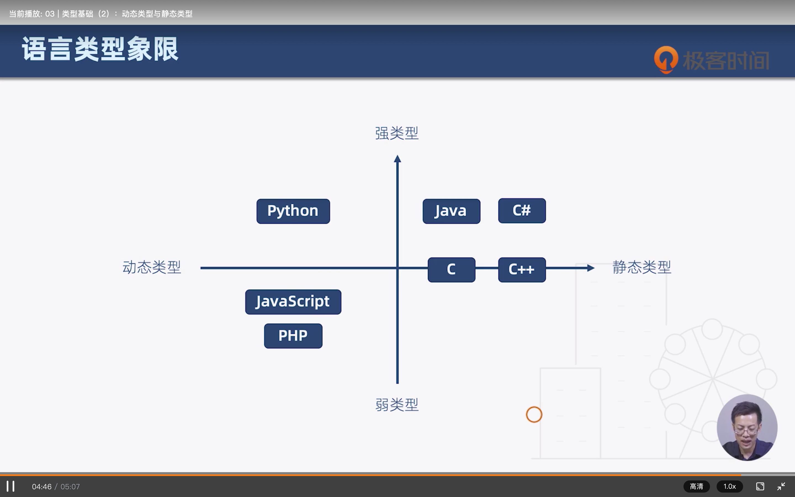

# 强类型和弱类型  动态类型和静态类型

## 强类型和弱类型

- 强类型语言：不允许改变变量的数据类型，除非进行强制类型转换

## 动态类型和静态类型

- 静态类型语言：在**编译阶段**确定所有变量的类型
- 动态类型语言：在**执行阶段**确定所有变量的类型

### 常用语言类型判断

- JS、PHP是 弱类型 动态语言
- Patyon是 强类型 动态语言
- Java是 强类型 静态语言
- C C++是静态类型语言

- 
