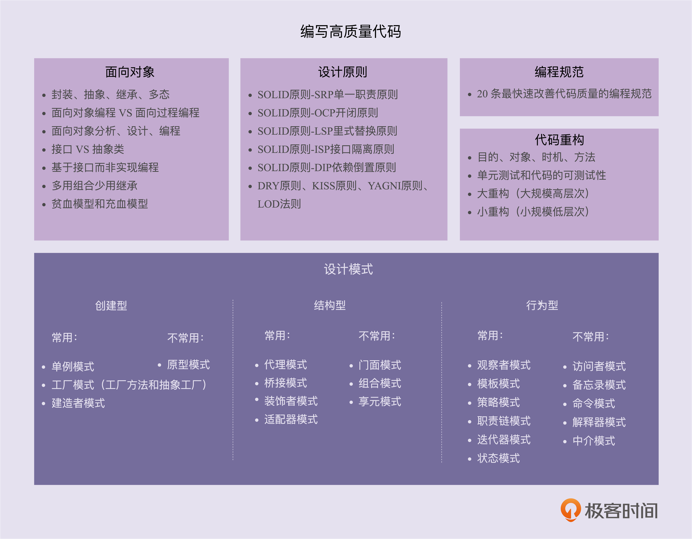

# 什么是设计模式

- 

- 怎么写出好的代码？
- 面向对象、设计原则、设计模式、编程规范、代码重构

- 三种编程范式
  - 面向对象
  - 面向过程
  - 函数式编程

## 面向对象编程和面向过程编程

- 面向对象编程语言的代表： C++ Java  不那么严格的话，JS 和 Python
  - 以类或者对象作为组织代码的基本单元

- 面向过程编程语言的代表: Basic Pascal C
  - 它以过程（可以为理解方法、函数、操作）作为组织代码的基本单元，以数据（可以理解为成员变量、属性）与方法相分离为最主要的特点。

> 面向过程 和 面向对象 语言的区别

- 首先要注意的一点就是，面向过程的编程语言和面向对象的编程语言，并不是完全对立的。面向过程的编程语言照样可以写出面向对象的代码。

- 代码组织方式不同：面向过程风格组织的代码，方法和数据结构的定义是分开的；面向对象风格的代码被组织成一个类，方法和数据结构被绑定在一起，定义在类中。

- OOP 更加能够应对大规模复杂程序的开发

- OOP 风格的代码更易复用、易扩展、易维护

- OOP 语言更加人性化、更加高级、更加智能
  - 从指令到汇编语言到面向过程编程语言到面向对象编程语言，越高级的编程语言离机器越’远‘，离人越’近‘
  - 前三种语言是一种计算机思维方式，面向对象语言是人类的思维方式。前三种语言是一种流水线面条形的思考方式，面向对象编程时，我们在思考如何给业务建模，如何将真实的世界映射为对象或者类。

> 面向对象编程比面向过程编程，更加容易应对大规模复杂程序的开发。但像 Unix、Linux 这些复杂的系统，也都是基于 C 语言这种面向过程的编程语言开发的，你怎么看待这个现象？

- 操作系统是业务无关的，它更接近于底层计算机，因此更适合用面向过程的语言编写。而接近业务的也就是接近人的软件，则更适合用面向对象的语言编写。

## 哪些代码看似是面向对象编程，实际上是面向过程编程

- 尽量不要给属性定义setter方法了
- 不要滥用全局变量和全局方法
  - 将许多的变量都定义在Constants类里面，将许多的方法都定义在Utils类里面。上面这样会造成 数据（变量、属性等）和方法（函数等）的分离就是典型的面向过程编程的方式。
  - 也不是说上面的这种几种方式就不能用。当确是需要使用的时候，我们可以将Constants类或者Utils类这样的大类，分解成一些功能比较单一的类
- 定义数据和方法分离的类

## 在面向对象编程中，WHY 为什么容易写出面向过程风格的代码

- 面向过程编程，恰好符合人的这种流程化思维方式。
- 面向对象编程，正好相反，他是将任务翻译成为一个个小的模块，设计这些模块之间的交互，最后按照流程将模块组装起来。

## 面向对象编程和面向过程编程，需要华山论剑，一争高下吗

- 这两种编程方式，都不是非黑即白，你死我活的。
- 这两种编程范式，都可以使用，甚至在变相对象编程里面也可以使用面向过程编程的方法（类里面每个方法的实现逻辑，不就是面向过程风格的代码吗）
- 说到底一句话就是，不管使用哪种编程范式，我们的目标就是写出**易维护，易读，易复用。可扩展**的高质量代码

## 面向对象分析，面向对象设计，面向对象编程

- 面向对象分析的产出是详细的需求描述
- 那面向对象设计的产出就是类: 类是现实世界中事物的一个建模。那么具体类的设计又是怎么样的呢？
  -1. 划分职责进而识别出有哪些类
  -2. 定义类及其属性和方法
  -3. 定义类与类之间的交互关系
  -4. 将类组装起来并提供执行入口
