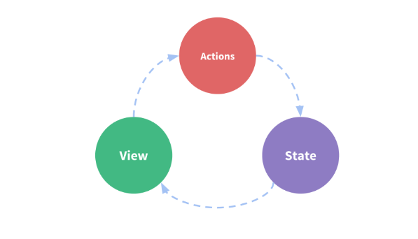

# vuex store

> [vuex](https://vuex.vuejs.org/)

- 深刻理解 State --> View --> Action

  - state getters mutations actions 在 store 中定义--**仔细理解！**
  - mapState 和 mapGetter 在 computed 计算属性中定义--**仔细理解！**
  - mapMutations 和 mapActions 在 methods 中定义--**仔细理解！**
  - 其中 computed 计算属性 属于 state(包括 mapState 和 mapGetter) 的动态化； 其中 methods 属于 action 的层面（包括 mapMutations 和 mapActions）--**仔细理解！**

## 最简状态管理

```js
new Vue({
  // state
  data() {
    return {
      count: 0,
    }
  },
  // view
  template: `
    <div>{{ count }}</div>
  `,
  // actions
  methods: {
    increment() {
      this.count++
    },
  },
})
```

- 

```js
const store = new Vuex.Store({
  state: {
    todos: [
      { id: 1, text: '...', done: true },
      { id: 2, text: '...', done: false },
    ],
  },
  getters: {
    doneTodos: (state) => {
      return state.todos.filter((todo) => todo.done)
    },
  },
  mutations: {
    increment(state) {
      state.count++
    },
  },
  actions: {
    increment(context) {
      context.commit('increment')
    },
  },
})
```

## state

- store 下面的 state
- mapState：映射 store.state 到 local computed properties
- [vuex 源码：深入 vuex 之辅助函数 mapState](https://juejin.im/post/5ae433ab518825671a6388d5)

```js
//mapState方式
import { mapState } from 'vuex'
export default {
  computed: mapState([
    // 映射 this.count 为 this.$store.state.count
    'count',
  ]),
}

//上面这种方式 等同于 下面这种方式
import { mapState } from 'vuex'
export default {
  computed: {
    count() {
      return this.$store.state.count
    },
  },
}
```

## getter

- getters 根据一个 store state “计算” 出 derived state

- mapGetters: map 映射 store getters 到 local computed properties

```js
// 这里面的 doneTodos 就是一个派生state, 这个 doneTodos 会跟着this.$store.state.todos的变化而变化
const store = new Vuex.Store({
  state: {
    todos: [
      { id: 1, text: '...', done: true },
      { id: 2, text: '...', done: false },
    ],
  },
  getters: {
    doneTodos: (state) => {
      return state.todos.filter((todo) => todo.done)
    },
  },
  mutations: {
    increment(state) {
      state.count++
    },
  },
  actions: {
    increment(context) {
      context.commit('increment')
    },
  },
})

// 将getters(也就是derived state派生属性) 映射到本地的计算属性
import { mapGetters } from 'vuex'

export default {
  // ...
  computed: {
    // mix the getters into computed with object spread operator
    ...mapGetters([
      // 映射 this.doneTodos 为 this.$store.getters.doneTodos
      'doneTodos',
      'anotherGetter',
      // ...
    ]),
  },
}
```

## mutations

- mutations 有点像事件 events. mutations 包含 一个 type 和 一个 handle.
  - 但是我们不能直接调用一个 mutations handle,想要执行这个 handle,我们需要调用 store.commit(type)，这就很像事件的注册过程。
  - 在下面的代码里面，increment 就是 type, store.commit()触发这个 mutation
  - mapMutations 的作用就是 映射 组件 methods 到 this.$store.commit()

```js
import { mapMutations } from 'vuex'

export default {
  // ...
  methods: {
    ...mapMutations([
      'increment', // map `this.increment()` to `this.$store.commit('increment')`

      // `mapMutations` also supports payloads:
      'incrementBy', // map `this.incrementBy(amount)` to `this.$store.commit('incrementBy', amount)`
    ]),
    ...mapMutations({
      add: 'increment', // map `this.add()` to `this.$store.commit('increment')`
    }),
  },
}
```

## actions

- actions 与 mutations 很像，他们的区别就是
- mutations 是 mutate 改变 state，而 actions 是 commit 提交 mutations
- mutations 只能包含同步操作，而 Actions 能包含任意的异步操作

```js
// actions 的写法一
const store = new Vuex.Store({
  state: {
    count: 0
  },
  mutations: {
    increment (state) {
      state.count++
    }
  },
  actions: {
    increment (context) {
      context.commit('increment')
    }
  }
})

// actions 的写法二
// ES6 中 赋值解构的写法
actions: {
  increment ({ commit }) {
    commit('increment')
  }
}
```

- Actions 是通过 store.dispach()方法触发的

```js
store.dispatch('increment')
```

- Actions 里面可以有异步操作
  - 2 种调用异步的方式

```js
actions: {
  incrementAsync ({ commit }) {
    setTimeout(() => {
      commit('increment')
    }, 1000)
  }
}
```

```js
// dispatch with a payload
store.dispatch('incrementAsync', {
  amount: 10,
})

// dispatch with an object
store.dispatch({
  type: 'incrementAsync',
  amount: 10,
})
```

- Actions 的组合
  - 在 store 里面组合 Actions 和定义 异步 Action
  - 在 methods 里面 调用 actions

```js
//Promise 方法
actions: {
  actionA ({ commit }) {
    return new Promise((resolve, reject) => {
      setTimeout(() => {
        commit('someMutation')
        resolve()
      }, 1000)
    })
  }
  actionB ({ dispatch, commit }) {
    return dispatch('actionA').then(() => {
      commit('someOtherMutation')
    })
  }
}

//async/await 方法
// assuming `getData()` and `getOtherData()` return Promises
actions: {
  async actionA ({ commit }) {
    commit('gotData', await getData())
  },
  async actionB ({ dispatch, commit }) {
    await dispatch('actionA') // wait for `actionA` to finish
    commit('gotOtherData', await getOtherData())
  }
}
```

```js
// 在methods里面调用actions
store.dispatch('actionA').then(() => {
  // ...
})
```

- 让我们再来看看这张图把！
- 

  - 当我们看到这张图的时候，其实我们主要做的动作就是 dispatch(actions) 和 commit(mutations) 这两个动作
  - 至于 Mutate 和 Render 这两个动作，Vue 框架都帮我们做好了。

## 一个实际项目的例子

```js
// store/index.js
const store = new Vuex.Store({
  state: {},
  getters: {},
  mutations: {},
  actions: {},
})
```

```js
//src\main.js
import store from './store/index'

//src\store\index.js
import Vue from 'vue'
import Vuex from 'vuex'

Vue.use(Vuex)

// 公共模块
import common from './modules/common'
// 导出 store 对象
export default new Vuex.Store({
  modules: {
    common,
  },
})
```

## mapGettr 的分析

- 将派生的 state 映射成为 一个计算属性 computed， 也就是动态属性。
- 动态属性的值 doneTodosCount 会跟随着 this.\$store.getters.doneTodosCount 的改变而改变
- 动态属性设置好之后， 可以在 watch 中监听 动态属性 doneTodosCount 的变化

```js
// 1.经典的方式-- 混入到 computed 计算属性里面

// store.js
getters: {
  // ...
  doneTodosCount: (state, getters) => {
    return getters.doneTodos.length
  }
}
// Component.vue
import { mapGetters } from 'vuex'
export default {
  // ...
  computed: {
    // mix the getters into computed with object spread operator
    // 方式一：同名的getter map
    ...mapGetters([
      'doneTodosCount', // map `this.doneTodosCount` to `this.$store.getters.doneTodosCount`
      'anotherGetter',
      // ...
    ])

    // 方式二：不同名的getter map
    ...mapGetters({
      // map `this.doneCount` to `this.$store.getters.doneTodosCount`
      doneCount: 'doneTodosCount'
    })

    // 方式一和方式二 等价于 下面的方式三
    doneTodosCount () {
      return this.$store.getters.doneTodosCount
    }

  }
}

// 2.不常规的方式-- 混入到 methods 方法里面
// common.js store
const getters = {
	isInit(state) {
		return state.isInit
	}
}
export default {
	state,
	mutations,
	getters,
	actions
}


// Index.vue
// **注意：mapGetters放在methods里面是不妥当的， 应该放在computed里面, 这时候就只需要this.isInit, 而不是this.isInit()**
// **又注意： 如果mapGetters放在methods里面,也是可以的，只是需要调用 this.isInit()**
// 最好是放在computed里面，因为有computed有缓存机制，而methods里面是function域，每次都会调用一次，性能开销大。
methods: {
  ...mapGetters(["getCurSelected", "isInit"]),  // map `this.isInit` to `this.$store.getters.isInit`
},

created () {
  this.curSelect =
    this.$util.getLocalData(this.$GLOBAL.CURSELECT_SESSION_KEY) || this.getCurSelected() || "/bizmodel"
  let cacheInit = this.$util.getLocalData(this.$GLOBAL.ISINIT_SESSION_KEY)
  if (null === cacheInit) {
    this.init = this.isInit()  // 在这里调用 methods 里面的 isInit
  } else {
    this.init = this.$util.getLocalData(this.$GLOBAL.ISINIT_SESSION_KEY) && this.isInit() && true
  }
  this.avatarUrl = this.$util.getLocalData(this.$GLOBAL.USER_SESSION_KEY).coverpicture;
  this.getNum();
},

computed: {
  getInit () {
    return this.isInit() // 在这里转化为计算属性getInit
  }
},
watch: {
  getInit (newVal) { // 监听计算属性的变化
    this.init = newVal
    this.$util.setLocalData(this.$GLOBAL.ISINIT_SESSION_KEY, newVal)
    if (newVal) {
      this.actionSelected("/step")
      this.$router.replace("/step")
    }
  }
},
```

## mapActions 的分析 (搞懂了 **actionInit** 就搞懂了 mapActions 和 actions 的具体玩法)

- 在 methods 中 findConfig 方法里面 调用 this.actionInit()方法。 由于有了 mapActions,实际上是调用了 this.\$store.dispatch('actionInit')
- 然后呢？ 就进入 common.js 里面，会自动调用 actionInit(context, isInit) --> context.commit('mutationInit', isInit) --> mutationInit(state, isInit) {
  state.isInit = isInit }
- --> 接下来 mutate 改变 state 以及 state 的改变触发 render 更新的过程，都交给 Vue 了

```js
//common.js
const actions = {
	actionInit(context, isInit) {
		return context.commit('mutationInit', isInit)
	}
}
const mutations = {
	mutationInit(state, isInit) {
		state.isInit = isInit
	}
}
export default {
	state,
	mutations,
	getters,
	actions
}

//Config.vue
methods: {
  ...mapActions(
    ['actionInit', 'actionSelected'] //actionInit 代表什么意思呢？ map `this.actionInit()` to `this.$store.dispatch('actionInit')`
  ),

  // 下面的这个methods 等价于 上面的 ...mapActions(['actionInit'])
  actionInit() {
    return this.dispatch('actionInit', {isInit})
  }

  findConfig () {
    let _self = this;
    getRequest(confFind, { peid: _self.eid }).then(ret => {
      let data = ret.data;
      if (200 === data.code) {
        // something else
        let isInit = null === configPlanList || 0 === configPlanList.length
        _self.actionInit(isInit)  //actionInit 在这里用到
      }
    });
  }
}
```

## store module 方案

- [vuex](https://vuex.vuejs.org/zh/guide/modules.html)

  - 这里面的命名空间 namespace 可以暂不考虑。在实际项目中运用较少。

- [模块化方案实战](https://segmentfault.com/a/1190000007667542)
