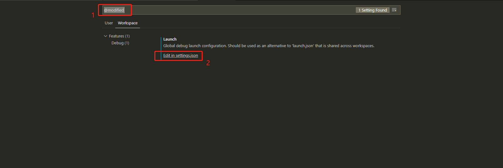
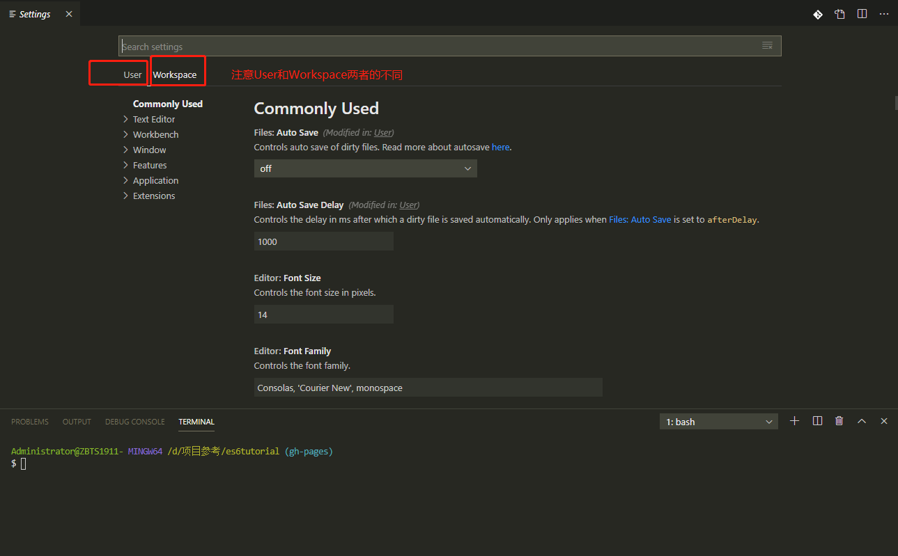
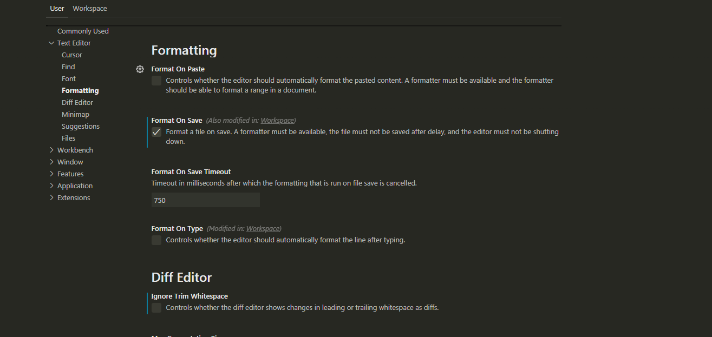

# 代码格式化配置

- 怎么做到 项目文件保存的时候就已经格式化了代码

## 第一步：vscode 中下载 Prettier 插件，然后配置根目录下的.prettierrc 文件

- **还有一种更好的办法，就是使用 Beautify 插件，而不是使用 Prettier 插件**

- 手动编写.prettierrc 配置文件

```json
{
  "printWidth": 120,
  "trailingComma": "all",
  "tabWidth": 2,
  "semi": true,
  "singleQuote": false
}
```

- [.prettierrc 文件的自定义配置](https://prettier.io/docs/en/options.html)

- 快捷键 alt+shift +F，就能根据.prettierrc 文件的规则 手动 格式化文件

## 第二步： 在 setting.json 里面修改字段 开启 文件保存就格式化

- 文件 ------>【首选项】---------->【设置】，打开 setting.json
- 
- 注意 setting.json 中两种模式的不同，User 模式对应着全局（也就是整个电脑里面的所有项目），workSpace 对应着局部（也就是当前的这个项目）
- 

```json
{
  "editor.formatOnType": true,
  "editor.formatOnSave": true
}
```

## 第三步：在 Text Editor 里面的 Formatting 里面 勾选上 Format On Save

- 

## 怎么快速关闭 文件保存的时候就已经格式化??

setting.json 中两种模式的不同 workSpace 模式下，删除下面的代码

```json
{
  "editor.formatOnType": true,
  "editor.formatOnSave": true
}
```
