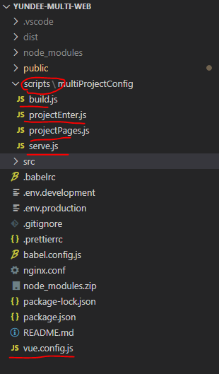

# vue 多页面应用配置

- [demoz 自己搭建的脚手架](https://github.com/shuimu0579/multi-page-program-vue)

-[vue-cli3 项目优化之多项目共用配置、组件动态打包 node 命令](https://juejin.im/post/6844903878647873549)

-[vue-cli3.0 多页面配置](https://juejin.im/post/6844903733856305165)

## 项目多页面应用配置背景

- 两个独立的项目中有很多共性的需求和交互，有很多的组件可以共用，这样的话当做两个项目做也不太好，项目的冗余度太高。
- 既然不能当做两个项目来做，那么我用 cnpm 私库来放置公共的组件不可以嘛？ 这里有一个问题，现在的代码里面有很多还是涉及到公司业务方面的，我们私有 cnpm 的目的只是希望存储一些公用方法、前端封装组件。
- 那我把它当做一个项目来做可以吗？那在一个项目里面怎么合理的区分多的打包文件？我们能想到的就是一个项目的多页面配置。

- 
- vue.config.js

```js
const multiProjectConfig = require('./scripts/multiProjectConfig/projectPages')
const projectEnter = require('./scripts/multiProjectConfig/projectEnter')
module.exports = {
  // other code
  outputDir: `./dist/${projectEnter.name}`,
  pages: multiProjectConfig.pages,
  // other code
}
```
