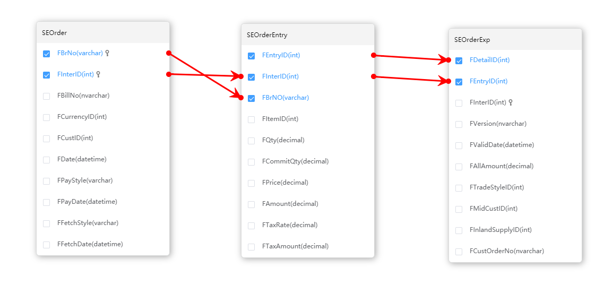

# vue 里面的 图表绘制 jsPlumb

- [jsPlumb github](https://github.com/jsplumb/jsplumb)

- [jsPlumb 中文基础教程](https://wdd.js.org/jsplumb-chinese-tutorial/#/?id=_214-%E5%88%A0%E9%99%A4%E8%8A%82%E7%82%B9%EF%BC%8C%E5%8C%85%E6%8B%AC%E8%8A%82%E7%82%B9%E7%9B%B8%E5%85%B3%E7%9A%84%E8%BF%9E%E6%8E%A5)

- [jsPlumb 与 vue 学习总结](https://zhuanlan.zhihu.com/p/43642654)

- 
