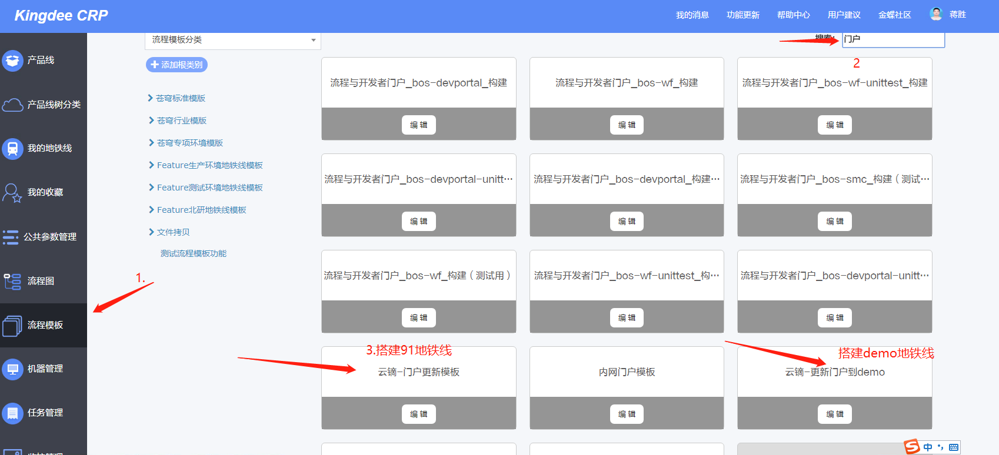
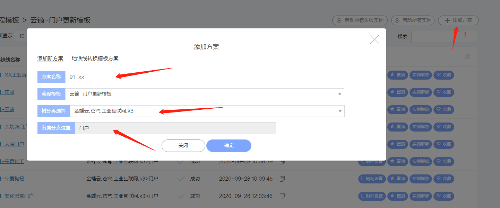

# 00-怎么发布 DEMO 演示环境和新建 91 和 demo 的地铁线.md

## 1、[进入前端地铁线列表](https://docs.qq.com/sheet/DWHFHRFJmc0tVVFhC?tab=BB08J2)

- 在这个列表中新建一列，如下图所示：

```html
91-张家口工业互联网平台 张家口 28831 91环境 /zjk
```

- 其中 XXX(比如 zjk)是 91 环境的虚拟租户 id。另外，一般 XXXdemo(比如 zjkdemo)是 demo 环境的虚拟租户 id。, 这个需要与朋伟一起商量

## 2、在内网中新建地铁线, 参考如下的两张图

- (注意：126 环境是在流程模板的这个目录下面的 `流程模板--云镝门户引擎安装-内网模板` )
- (注意：91/预生产/生产 环境是在流程模板的这个目录下面的 `流程模板--云镝门户引擎安装-外网模板` )

- 
- 

- 然后进入 内网中打开 http://crp.kingdee.com/cd/mymetro ，然后进入 我的地铁线 ，进入刚生成的地铁线， 开始编辑。

## 3

> 对于用git作为代码管理工具的:

- 代码里面不需要在**vue.config.js** 里面修改**publicPath**
- 也不需要自己build,不过为了地铁线能够顺利构建，最好还是自己手动build试试，看看能不能build成功。

> 对于用svn代码管理工具的，需要按照下面这样弄：

- 新建相应二级平台的 release 分支（比如 release-zhangjiakou）,然后基于这个分支打包，讲打包好的内容复制到 http://192.168.16.99/svn/kingdee_idy/trunk/erp/web2.0/platfrom 下面的 nextcloud_wcjkq 文件夹 里面的 dist 文件夹里面。
- 注意：如果http://192.168.16.99/svn/kingdee_idy/trunk/erp/web2.0/platfrom 里面没有 nextcloud_wcjkq 文件 那么需要你新建一个 nextcloud_wcjkq/dist
- **vue.config.js** 里面的 **publicPath** 记得修改， 比如虚拟租户是 zjk 的话， publicPath: '/zjk/'

## 4、怎么更好的对地铁线进行配置呢？

- 注意地铁线的配置，**需要特别小心**一个一个参数的校对，如果有一个参数有问题的话， 可能地铁线就跑不起来了，哪怕参数修改过来了，再跑地铁线，还是跑不起来。

- 原则就是用**内网**一个原来配置过的模板，比如现在配 `91-张家口`,可以参考原来的 `91-西宁`。 然后**在外网**输入网址 http://172.20.176.91/XXX(比如http://172.20.176.91/zjk),验证是否通过了91的部署。
  - 注意：在配置地铁线参数的时候，91 的 虚拟租户 id 一般为 XXX(比如张家口平台就是 zjk, 与朋伟沟通好保持一致即可)
- 等到 91 已经部署好的，就可以建立 demo 环境的。配置的原则还是那样--参考原来**内网**配置过的模板，比如现在是`demo-张家口`，可以参考原来的`demo-西宁`，然后**在外网**输入网址 https://demo.yundeeiot.com/XXX(比如https://demo.yundeeiot.com/zjk),验证是否通过了demo环境的部署。
  - 注意：在配置地铁线参数的时候，demo 的 虚拟租户 id 一般为 XXXdemo(比如张家口平台就是 zjkdemo, 与朋伟沟通好保持一致即可)

## 5、91 和 demo 部署上去之后，UI 提供 logo 和 banner 图片给朋伟，朋伟配置虚拟租户和首页菜单。
