

这篇主要讲的是 GitHub 的使用，我将通过图文的形式展现 GitHub 的使用。

**划重点！**，使用 github 最好 kexue 上网(kexue 上网工具教程：https://mp.weixin.qq.com/s/Pc8l-PnEWIYYMr0l9CgxOw )。

<blockquote class="blockquote">为什么要使用GitHub</blockquote>

GitHub( https://www.githubs.cn/post/what-is-github )是一个面向开源及私有软件项目的托管平台，因为只支持 git 作为唯一的版本库格式进行托管，故名 GitHub。

甚至你可以简单粗暴的**把它当作一个笔记本**，用来存储任何东西。把它当作一个笔记本，看着不起眼的几个字，确是我推荐 GitHub 给你的最主要原因！！！

对于程序员来说，GitHub 这个项目托管平台太重要了--不仅仅是由于 GitHub 上面有许多的优秀开源项目可供学习，还因为能在 GitHub 上面构建自己的项目或者技术输出文档。它让我们既能输入又能输出，形成输入输出的闭环，也难怪 GitHub 被称为全球最大的同行社交平台--简单来说就是，用你的作品用你的产出来社交。

对于非程序员来说，不用写代码，也不用写技术文档，GitHub 这个平台是不是就没什么用了？还记得我上面说的那句话不--把它当作一个笔记本。你估计还有疑问--市面上的记事本/笔记本这么多，不写代码的我，为什么还有必要用 GitHub 这个平台呢？

- 想必大家都用过`有道云笔记`、`印象笔记`这样的云笔记工具，或者`记事本`、`备忘录`这样的文本记录工具，甚至`百度网盘`这样的云盘， 它们都可以有效的存储我们的图文资料。上述的这些工具，随着存入的资料越来越多，就会变得越来越难以管理了--最终的结果就是那些工具成了`垃圾场`，放在里面的绝大多数内容基本上都不会去看一眼了。想想这样的一种场景吧：工具里面存了几个 G、几十个 G 的学习资料，可是就是没有进去看过几次，这样又有什么什么用呢？不过是增加一点虚幻的自我安慰罢了。

- 而在 GitHub 上面，里面的内容是自己一点一点的的输入进去的，在输入的过程中就凝结了自己的思考，很明显的，这样的输出质量是只会一股脑的存资料所不能比的。
  - 如果你的这些东西，不想让其他任何人看到，你可以将你的项目设为私密的，这样这个项目里面的所有内容都只有你可见了。
  - 如果你觉得自己写的东西不够好，没关系，先写下来；以后有新思路了再慢慢迭代--就像写代码一样，可以不断的优化你的项目，更难得的是，你的每一次修改或者优化提交，都有相应的提交记录，这样一点一滴的充实和优化你的项目，是一个很有成就感的过程。其实这样一点点的迭代项目，也是符合心理学中"小步子原理"--将一个大目标分解成小的目标，小到不可能失败的小目标，然后这一个个的小目标都有清晰的路径可以实现，最终这样大目标也能顺利的实现--GitHub平台配合 git 版本管理系统刚好提供了这样的一种方式，让 GitHub 里面的项目不断迭代不断优化。
  - GitHub 能够很好的支持 markdowm 语法，有了这样的语法，就能够让我们将注意力完全放在项目内容上，而不是耗时费力的文字格式排版上。

<blockquote class="blockquote">怎么下载文字编辑工具 Visual Studio Code</blockquote>

- Visual Studio Code 的初衷的作为编写代码的编辑器，但是这款工具真的太好用了，好用到已经不仅仅是写代码的程序员在用了，许多非程序员也会用这个工具，有一些内容创作者会用 markdown 语法创作，而 Visual Studio Code 就完美支持 markdown 语法，还能实时预览效果。
- Visual Studio Code 里面丰富的插件生态，比如写 markdown 的时候，可以用 Markdown All in One 这个插件，就可以轻松的对 markdown 语法的文件进行格式化了。
- Visual Studio Code 编辑器配合git这个版本管理工具(下面会讲到这个工具)，让我们的创作每一次提交都有迹可循，哪怕每次只是提交一点点创作内容--聚沙成塔，集腋成裘，在一次次的提交过程中达成当初的大目标。
- Visual Studio Code 编辑器下载地址: https://code.visualstudio.com/。
- 下载完成之后，打开这个编辑器，就是这个界面了。
  
  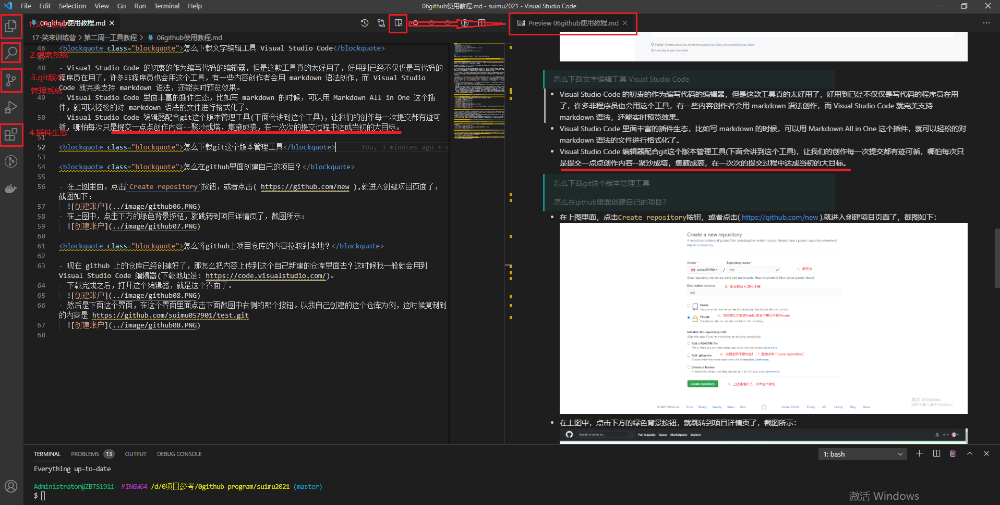

<blockquote class="blockquote">怎么下载git</blockquote>

- 上面我提到了git这个工具，对于程序员来说它是一个有用的版本管理工具，其实对于非程序员来说也是很有用的，比如一篇文章太长，就可以分多次写，可以用git多次提交,每次都会生成提交记录，也可以查看自己的提交记录。这样把一个大任务分解为许多的小任务，只要一个个小任务完成了，大任务也完成了，这样就不容易犯拖延症。甚至极端一点的，一篇文章没想好怎么写，先只写个标题踏出第一步，然后提交到远程仓库，下次有时间有思路了，在写了标题的基础上接着写，也是可以的。
- git下载地址( https://git-scm.com/download ),根据自己电脑系统的不同，点击不同的git下载链接。接下来的下载安装均以Windows为例。
  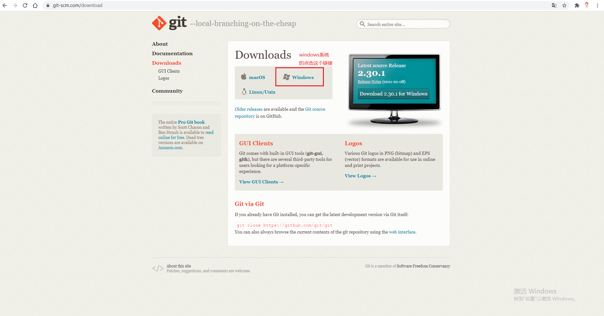
- git安装包下载之后，接下来就是安装环节了。然后一路next，**直到！**下面截图这一步，选择Visual Studio Code作为git的默认编辑器
  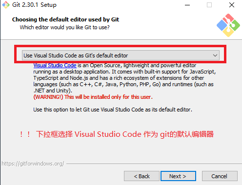
- 上图设置好之后，又是一通next,最后点击`install`按钮。
- 怎么判断git是否安装成功了呢？重新打开Visual Studio Code,有下面截图的内容，就代表git安装成功了。
  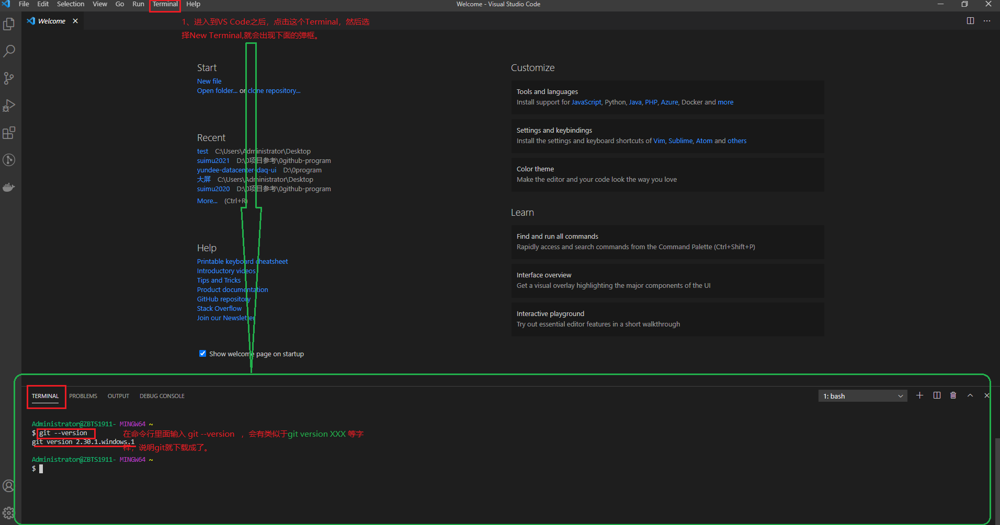

<blockquote class="blockquote">怎么注册GitHub账号</blockquote>

- 打开链接( https://github.com/ ), 点击页面右上侧的 `Sign in`按钮
- 进入注册页面，账号、密码、验证账号等等都填上，然后创建账户，截图如下：
  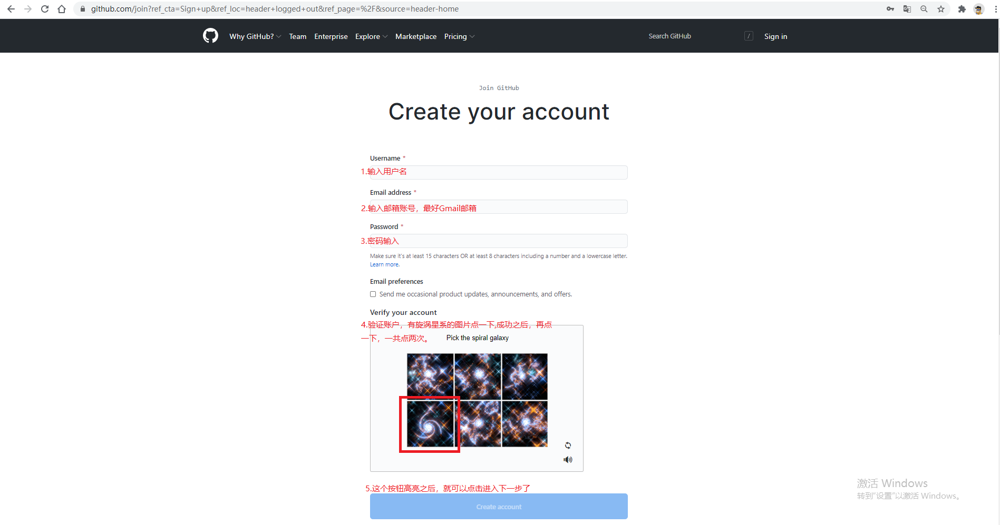
- 进入设置页面，截图如下：
  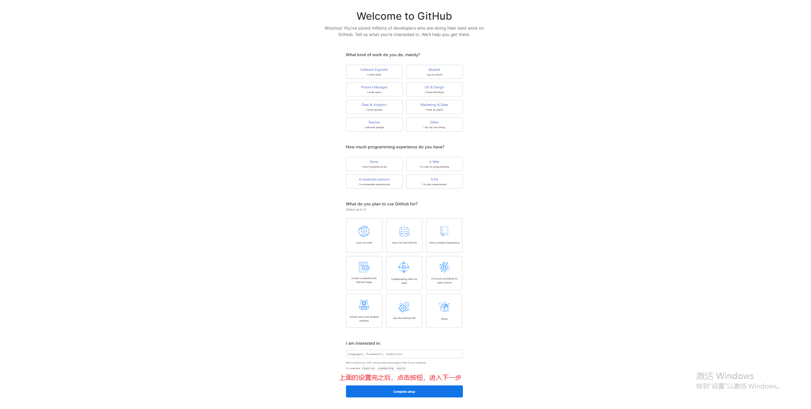
- 进入邮箱验证引导页
  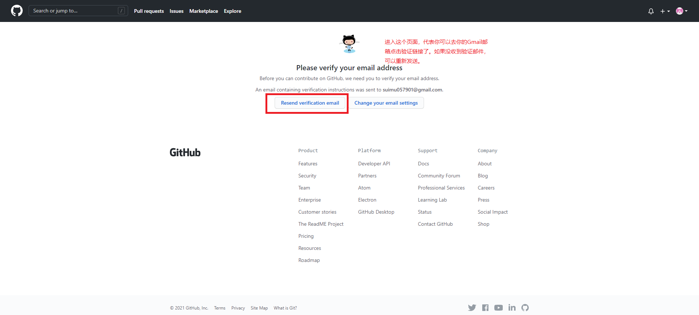
- 在邮箱里面验证成功，会跳转到验证确认页，截图如下：
  
- 至此，账号创建成功，点击`Skip this for now`按钮，就进入 github 创建项目（仓库）引导页，截图如下：
  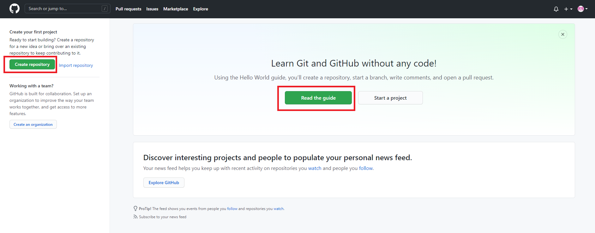

<blockquote class="blockquote">怎么在github里面创建自己的项目？</blockquote>

- 在上图里面，点击`Create repository`按钮，或者点击( https://github.com/new ),就进入创建项目页面了，截图如下：
  
- 在上图中，点击下方的绿色背景按钮，就跳转到项目详情页了，截图所示：
  

<blockquote class="blockquote">怎么将github上项目仓库的内容拉取到本地？</blockquote>

- 现在 github 上的仓库已经创建好了，现在这个仓库里面完全是空的，什么内容都没有。
  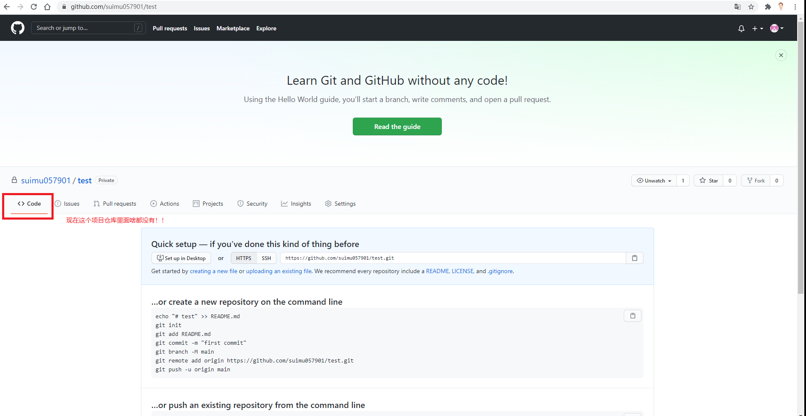
- 然后是下面这个界面，在这个界面里面点击下面截图中右侧的那个按钮。以我自己创建的这个仓库为例，这时候复制到的内容是 `https://github.com/shuimu0579/test.git`
  

- 打开Visual Studio Code，操作步骤如下所示：
  
- 在Visual Studio Code打开test这个项目之后，首先新建.gitignore和README.md这两个文件，并打开TERMINAL这个终端命令行工具，详细介绍如图所示：
- 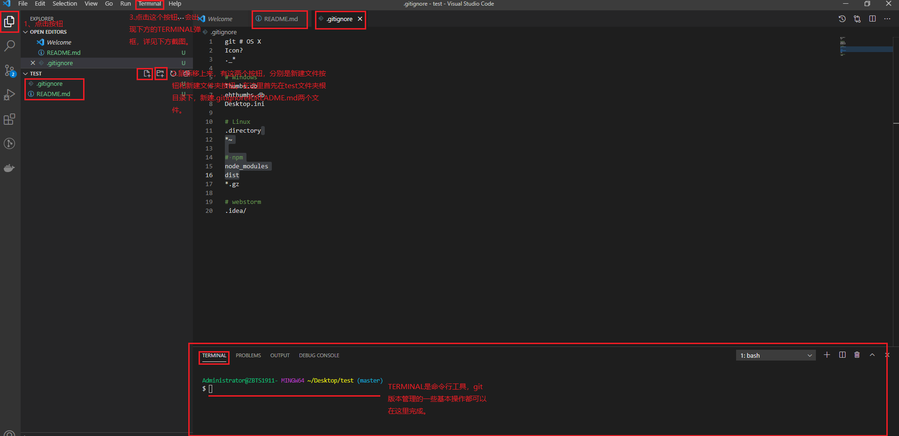

<blockquote class="blockquote">怎么将本地增添或者修改的内容同步到github远程仓库</blockquote>

现在已经增加了.gitignore和README.md这两个文件,现在怎么将这些修改同步到远程仓库？在**TERMINAL**面板里面,简简单单的几个git命令就能搞定了。修改的内容如下截图：
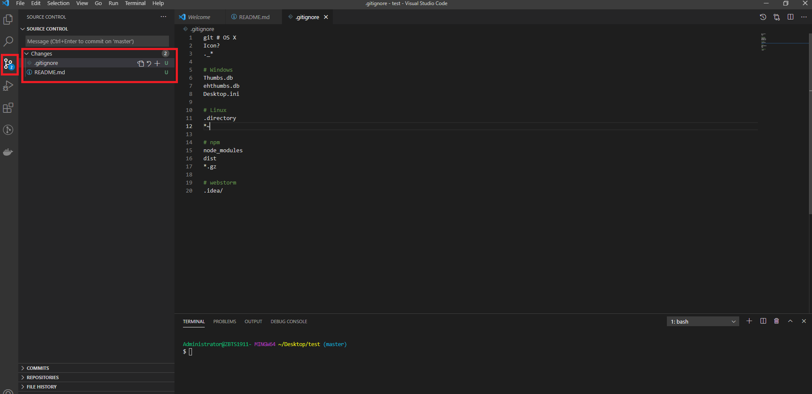

- `git add .`，增加所有的修改到stash暂存区
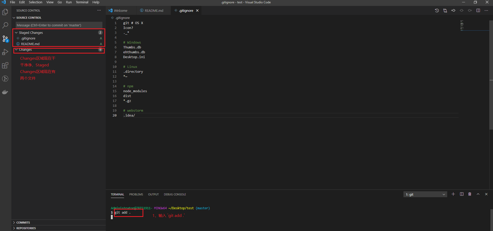

- `git commit -m 'change'`，将暂存区的内容commit提交到本地仓库，并生成一次commitId--也就是生成提交记录。
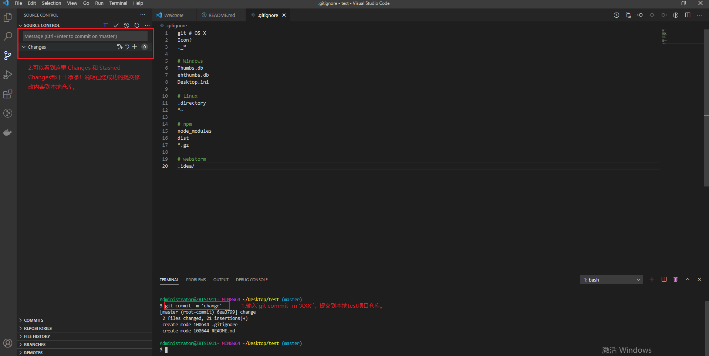
- 现在内容已经成功的提交到本地仓库，那怎么提交到远程github仓库? `git push`
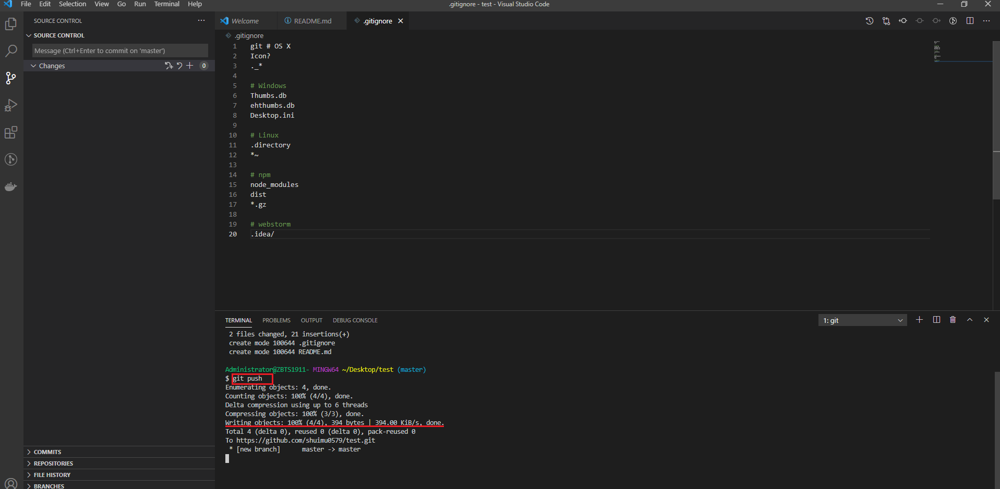
- 确认是否成功，在github网站上去看看
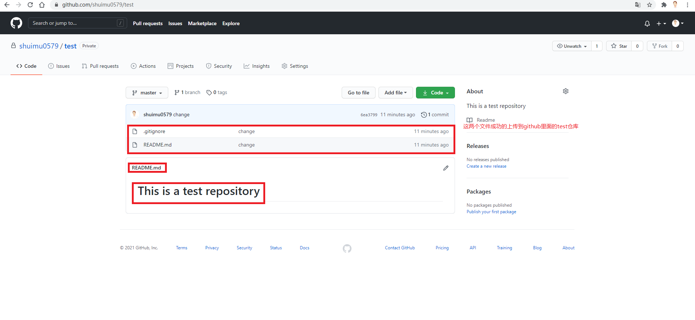

<blockquote class="blockquote">怎么拉取github上已经有更新的项目</blockquote>

- github上test项目里面已经有自己加的两个文件，那么在另一台电脑设备上也想修改这个test项目的内容，应该怎么做呢？
- 打开Visual Studio Code，操作步骤如下所示：
- 
- 进去本地test项目文件夹之后，首先执行`git pull`命令，保证拉下来的是最新的内容。
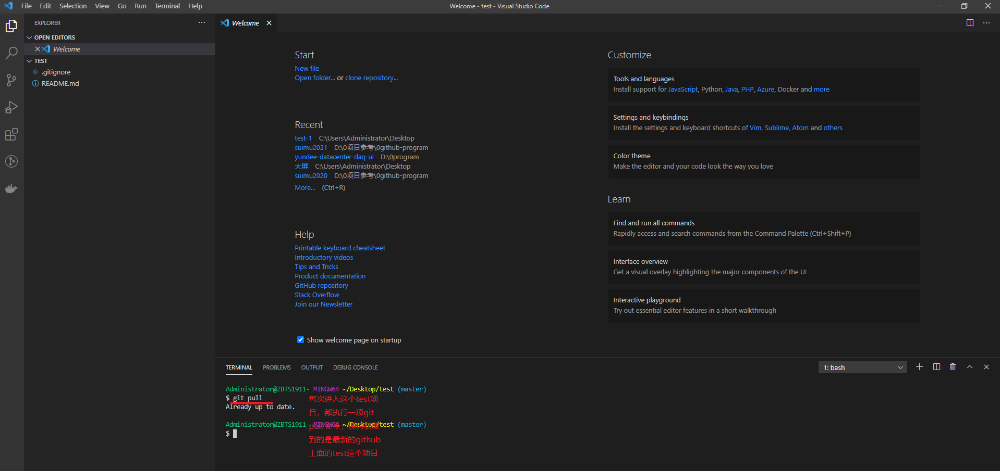
- 本机电脑有了项目文件夹之后（我这里是test文件夹），以后就不需要每次`Clone Repository`了，因为你已经把项目克隆到本地，你要做的仅仅是每次想编辑这个项目的时候，**首先 git pull 一下**，免得不必要的内容冲突。
- git常用的一些命令，可以网上搜索一下，参考示例：https://confluence.atlassian.com/bitbucketserver/basic-git-commands-776639767.html

这篇文章讲到了Visual Studio Code、git、github等工具的使用，信息量有点大，能够一路顺利操作下来，收获也将会是很大的。
