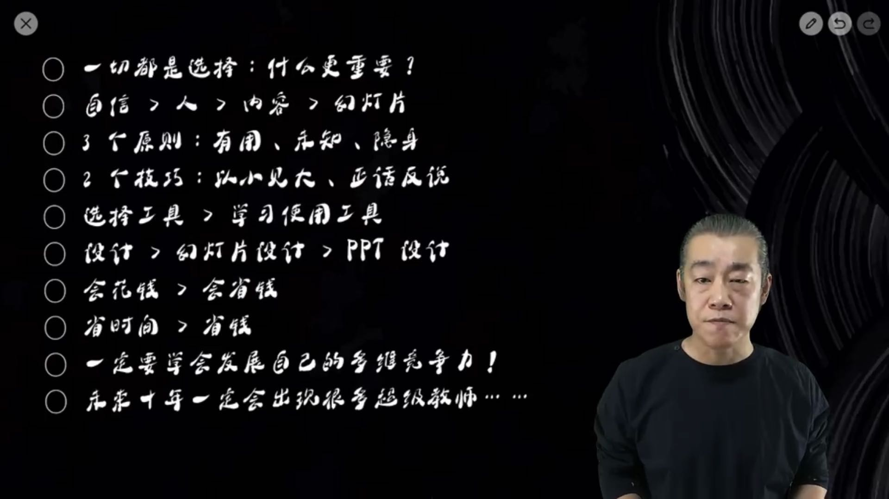

# 幻灯片课

## 什么更重要

自信 > 人 > 内容 > 幻灯片

- 巴菲特的演讲稿很差

## 内容的三个原则：

- 有用的内容
  - 站在人家的角度去写内容
  - 不是自娱自乐的表达，而是与听众的沟通
- 未知原则
  - 对观众来说是已知的还是未知的
  - 能不能带来新的信息
- 隐身原则
  - 将注意力从 你身上转移到 内容身上。
  - 不要自我介绍，一上来就讲内容，讲未知的内容

## 两个技巧

- 以小见大
  - 从一个小的话题开始，不要一开始就从宏大的话题开始。然后慢慢展开一个广阔的世界。
  - 你可以有理想，但是要从脚下的一点一滴做起
- ## 正话反说

## 自信 > 人

- 做得 ppt 再难看，也不如这个人难看。--自嘲

  - 一切都是心理建设。

- 跟别人比 （人生没有白走的路，每一步都算数）

  - 人家是有积累的现在，你是无积累的现在
  - 你要比较的是，人家有积累的现在二十自己有积累的未来

## PPT 原则

- 不难看原则
  - 留白
  - 简洁的模板
  - 图片少的模板
  - 动画多的模板

## 常用工具 - (会省钱 < 会花钱)

- prezi

## 新的时代怎么玩

- ipad
- 超级教师的时代来了

## 课程总结

- 
