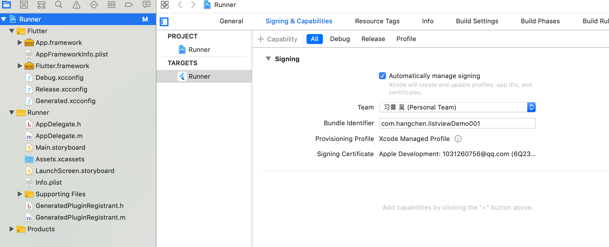

### 错误：Target of URI doesn't exist: package:fultter/material.dart
原因：flutter版本不匹配。flutter升级到了最新版本，而项目引用的是老版本。
解决：把项目引用的flutter升级到新版本。 运行 flutter upgrade  或者 flutter upgrade --force 

###  没有办法调试？下面两方面都需要的
> Xcode里面
- Team 要设置好
- Debug/Release/Profile  设置的Bundle Identifier  都设置为一样的。 
- 

> Vscode 里面
- Dart / Code Runner / Flutter 等插件的下载 

