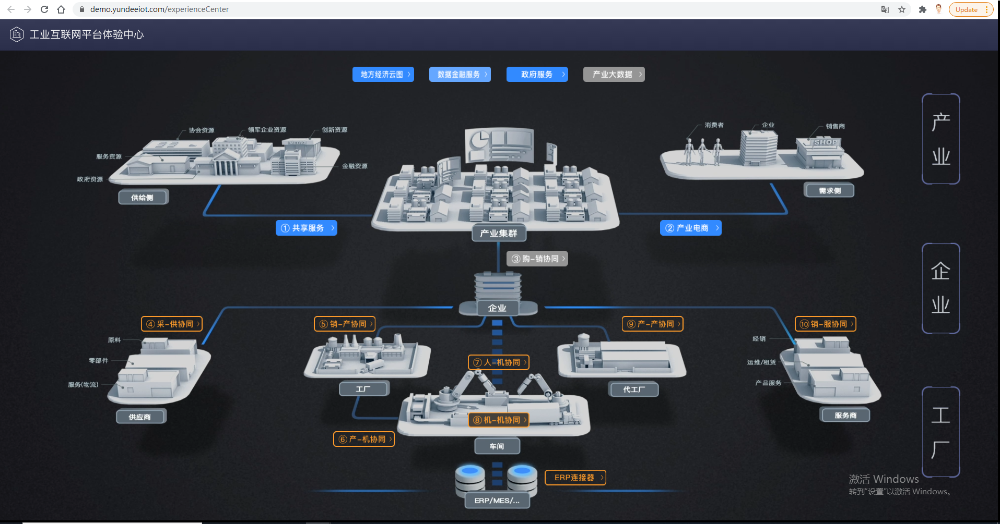
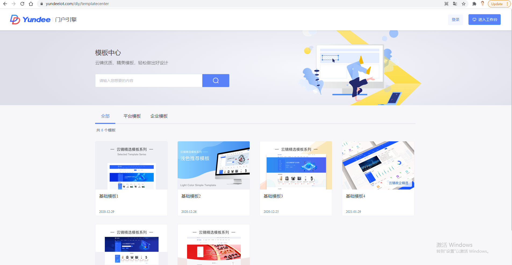

# TODOLIST

## TODOING

### vue3.0 源码解析（详见 https://github.com/cuixiaorui/mini-vue ）

### vue 中 SSR 的实现（详见《技术预研》 https://ssr.vuejs.org/zh/ ）

### 云开发做出一个可用的小程序（参考 https://github.com/shuimu0579/Fruit-store-mp ）

## DONE
- 云镝官网组件化( https://www.yundeeiot.com/home )
- 官网体验中心3D页面构建( https://demo.yundeeiot.com/experienceCenter )

- demo门户设计器( https://www.yundeeiot.com/diy/templatecenter )

- vue 配合 prerender-spa-plugin 和 vue-meta-info进行预渲染，以利于页面SEO优化
