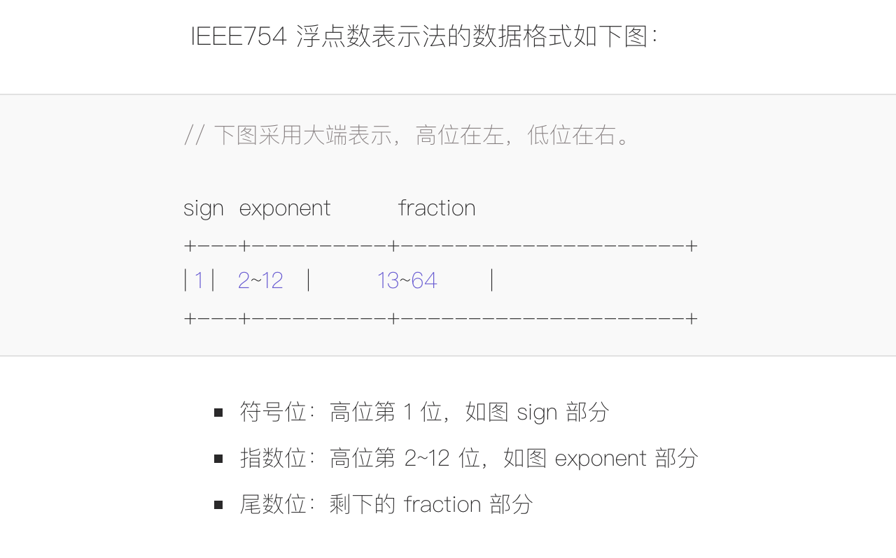

# IEEE754 浮点数精度丢失

- [IEEE754 浮点数精度丢失](https://www.barretlee.com/blog/2016/09/28/ieee754-operation-in-js/)
  

- [JavaScript 浮点数陷阱及解法](https://github.com/camsong/blog/issues/9)
- [双精度处理的 github 插件](https://github.com/nefe/number-precision)
