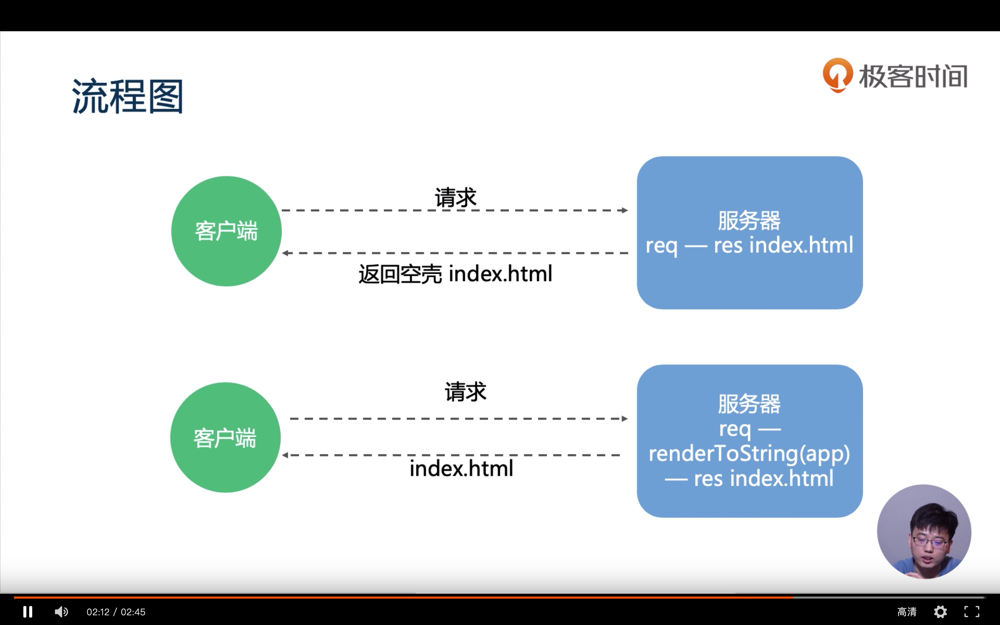

### SPA 单页应用

[单页应用的利与弊](https://stackoverflow.com/questions/21862054/single-page-application-advantages-and-disadvantages)

- 不利于 SEO （解决办法：服务端渲染 SSR）
- 不利于 url 的共享和收藏(shareable/bookmarkable URLs)
- 首屏加载时间长 (解决办法： 预渲染 Prerenderng)

### Prerenderng

- 预渲染常用与静态渲染

- 其实对于静态页面还可以使用一个 Vue 专用的静态页面生成器 Gridsome，算是对 React Gatsby 的一个模仿，通过 GraphQL 获取数据后生成 Prerender 的静态页面，对于纯展示性的项目来说性能、优化以及 SEO 做的都很好。

### SSR

- 适用于动态渲染,但是配置比较繁琐

### 那么 Nuxt 能做些什么呢？

- 静态站点 动态渲染 简化配置
- [Nuxt 官方文档](https://nuxtjs.org/guide/installation)

- 
- 
