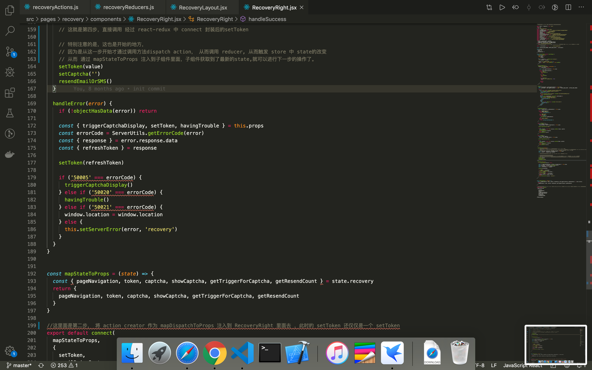

# redux and react-redux 的运用

## 以cisco的例子为例

- 详见目录 /Users/apple/Desktop/project/Cisco Project/oneident-recovery-ui-with-redux/src/pages/recovery/components/RecoveryRight.jsx

> 数据的流向是什么呢？ 以上图中的 RecoveryRight.jsx 页面为例子

- 这是第一步，开始通过函数调用触发 dispatch

```js
constructor(props) {
  super(props)
  this.state = {
    ...origins
  }
  const { recovery } = withServices('recovery')
  this.recovery = recovery

  emitter.on('sendEmailOrSMS', way => {  //在组件中emitter 监听并触发 this.sendEmail()
    way === 'email' ? this.sendEmail() : this.sendSMS()  
  })
}

// token captcha 是上一轮 action dispatch 结束的地方，结果就是 token captcha 这些state 获得了 更新。

// token captcha 等都是改变之后的state，只是作为props传递下来. 有了新的state,调用this.recovery.sendEmail(token, captcha)就会触发新的response数据更新
async sendEmail() {
  const { token, captcha,
    emailBeingSent, whatToTriggerCaptcha } = this.props

  whatToTriggerCaptcha('email')

  try {
    const response = await this.recovery.sendEmail(token, captcha)
    emailBeingSent()
    this.handleSuccess(response)
  } catch (error) {
    this.handleError(error)
  }
}

// setToken setCaptcha resendEmailOrSMS在这里面是action，只是作为props传递过来的
// 有了新的数据response，setToken等action又会进行 新一轮的 dispatch
handleSuccess(response) {
  const { setToken, setCaptcha, resendEmailOrSMS } = this.props
  const { value } = response.data.response
  setToken(value)
  setCaptcha('')
  resendEmailOrSMS()
}

```

- 这是第二步，当用户界面接收一个请求或者一个新的数据时，会dispatch一个action.
  - 在这里为什么没有看到dispatch呢？原来是因为 setToken = bindActionCreators(setToken, store.dispatch) ，此时的setToken就经过了 react-redux 中connect 这个API 的封装。
  - 这里面的 setToken 就是 recoveryActions 函数里面的 一个 action creator(也叫做action 函数), 要想利用中connect这个API的话，setToken必须是一个函数

```js
// recoveryActions.js
export const setToken = token => ({
  type: "SET_TOKEN",
  token
})
// RecoveryRight.jsx
import {
  smsSent, emailBeingSent, setToken,  
  triggerCaptchaDisplay, whatToTriggerCaptcha,
  setCaptcha, havingTrouble, resendEmailOrSMS
} from '../actions/recoveryActions'
```

- 这是第三步，然后这个action会调用相应的reducer. 在reducer里面就会返回新的状态

```js
// recoveryReducers.js
export const captcha = (state = '', action) => {
  switch (action.type) {
    case 'SET_CAPTCHA':
      return action.captcha

    default:
      return state
  }
}
```

- 这是第四步，在reducer里面就会返回新的状态，就会更新store

```js
// RecoveryLayout.jsx
import React, { Component } from 'react'
import { Provider } from 'react-redux'
import { createStore } from 'redux'
import reducers from './reducers/recovery'

import RecoveryLeft from './components/RecoveryLeft'
import RecoveryRight from './components/RecoveryRight'

const store = createStore(reducers)

class RecoveryLayout extends Component {
  render() {
    return (
      <div className="recovery">
        <RecoveryLeft xs={12} sm={4} />
        <Provider store={store}>
          <RecoveryRight />
        </Provider>
      </div>
    )
  }
}

export default RecoveryLayout
```

- 这是第五步，更新的store又怎么会触发 子组件RecoveryRight的更新呢？
  - 原来在RecoveryRight.jsx里面，有mapStateToProps， 子组件就会订阅store的状态改变。 就能用来建立子组件RecoveryRight 跟 store的state 的映射关系。
  - mapStateToProps可以不传，如果不传，组件不会监听store的变化，也就是说Store的更新不会引起UI的更新

```js
const mapStateToProps = (state) => {
  const { pageNavigation, token, captcha, showCaptcha, getTriggerForCaptcha, getResendCount } = state.recovery
  return {
    pageNavigation, token, captcha, showCaptcha, getTriggerForCaptcha, getResendCount
  }
}

export default connect(
  mapStateToProps,
  { // 这个对象就是mapDispatchToProps
    setToken,
    emailBeingSent,
    smsSent,
    triggerCaptchaDisplay,
    whatToTriggerCaptcha,
    setCaptcha,
    havingTrouble,
    resendEmailOrSMS
  }
)(RecoveryRight)
```

### redux数据流向 涉及到的页面

- 


