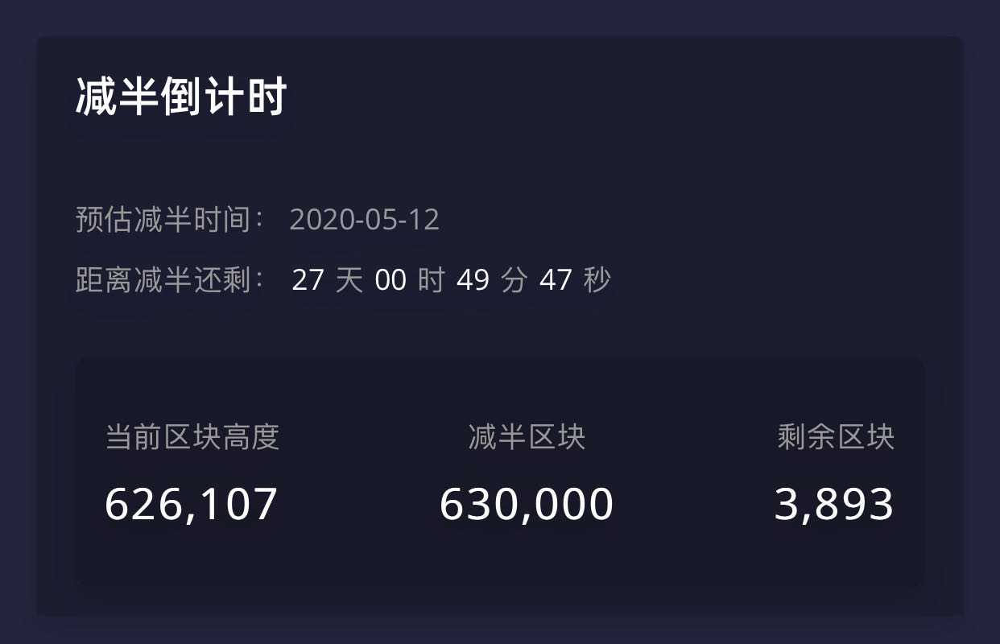

# 家里有矿是一种怎样的体验？

站在当下的时间点往回看，不知不觉中比特币已经问世 11 年了。

从比特币问世到现在，比特币通过媒体报道已经被死亡 380 次了，最近的一次报道是 2020 年 3 月 4 号。

为什么比特币就像打不死的小强，经历这么多次媒体口中的死亡还是屹立不倒，这是一个耐人寻味的问题。

2008 年美国次贷危机爆发，比特币就诞生于次贷危机爆发的过程中。

2008 年 11 月份，一份署名为中本聪的论文横空出世--《比特币：一种点对点的电子现金系统》（Bitcoin: A Peer-to-Peer Electronic Cash System）。

20009 年 1 月 3 日，最初的 50 枚比特币由中本聪挖矿开采出来。大概每经过 4 年比特币奖励就会减半，2012 年 11 月 28 号第一次减半，由 50 个减半为 25 个；2016 年 07 月 10 日第二次减半，由 25 个减半为 12.5 个;预计在 2020 年 5 月中旬比特币在 630,000 区块高度进行第三次减半，由 12.5 个减半为 6.25 个。

### 什么是比特币

> 比特币是区块链世界产生的第一个数字货币。

> 比特币也是一种点对点的电子现金系统，代表整个比特币的网络。矿工打包比特币网络中的转账信息并向全网广播，矿工争夺区块记账权的过程也是获得比特币奖励的过程，只有最先算出区块里面随机数，然后获得区块记账权的矿工才能获得比特币奖励。

> 比特币也是一家公司的股票，拥有比特币就相当于拥有比特币这家全球公司的股份，并享受这家公司发展带来的收益。

> 比特币还是一家去中心化世界银行，在这家银行里面，可以通过比特币转账进行交易和价值转移。比特币转账快捷、费用低廉、转账不会被外界追踪。

### 为什么选择租赁矿机挖比特币

最初获取比特币的方式一般有两种：第一种是用法币兑换比特币；还有一种就是通过挖矿获得，比特币网络差不多每隔 10 分钟打包一个区块，哪个矿池（矿工）最先计算出区块内的随机数，谁就能获得比特币奖励。

而我们说的比特币挖矿--相比于一次性用法币购买比特币--相当于持续不断的定投比特币，因为有了矿场、矿机、机器通上电，就能源源不断的获得比特币。

比特币挖矿也相当于打折购买比特币，挖矿获取比特币的成本差不多就是建设矿场成本、矿机成本、电力成本、矿场运维成本的总和。

这么好的生意，为什么很多去挖矿的小矿工却挖亏了呢？所谓术业有专攻，现在的比特币挖矿已经是一个很成熟的产业，再也不是比特币刚问世时，通过自己家的电脑就能够挖到比特币了。

前面说过最先计算出区块内的随机数的矿池（矿工），才有比特币的奖励。经历了十多年的发展，比特币网络的算力一直在持续的增加，普通人电脑中显卡的那点计算能力，相比于比特币网络的总算力，真的是沧海之一粟，基本没有可能最先算出区块内的随机数。

那么矿工们会怎么做呢？首先需要购买高算力低能耗的专业矿机，将许多矿机放到矿场里集中管理，然后许多的矿场联合起来形成矿池，某一个矿池拥有了许多矿场提供的算力，就能与其他的矿池展开算力的军备竞赛，通过最先算出区块内的随机数，获得比特币的奖励。矿池获得的这些比特币奖励怎么分配给某个矿场或者矿工呢？就是通过矿场或者矿工提供的矿机算力来分配。

比特币挖矿想要稳定的获取比特币，需要高算力低能耗的矿机、需要价格低廉供应稳定的电力、需要建设矿场的专业技术、需要对矿机的维修、需要对矿场的管理，所有的这些都是我们普通人不具备的条件。个人去买个几百几千台矿机，在矿机生产商那里是没有什么议价能力的；想要获取到价格低廉的电，没有用电规模的矿场也是很难的，而且还需要办理矿场营业执照，矿场不做到合规合法，分分钟矿场就被封掉；而建设矿场、维修矿机，更是专业的事情。

让专业的人干专业的事情，是提高效益的不二法门，这时候矿机租赁模式就正当其时了。我们用比特币租赁矿机，大矿工提供矿场、电力、矿场运维。挖出来的比特币首先支付硬性支出，比如电费支出、矿场维护费用，剩下来的比特币就在我们和大矿工之间分配，分配比例大概是三七开。为什么收益是这样分配的？因为是租赁矿机而不是购买矿机，如果半年之后不续租矿机了，矿场会把同样数量的比特币返还给你。

通过这样的抱团取暖，普通矿工用比特币租矿机，大矿工负责其他的方面，把大家的矿机聚集起来形成强大算力参与算力竞争，形成强大的规模效应的话，不管是小矿工还是大矿工，在比特币挖矿中的抗风险能力都得到很大提高，从而大家共享比特币收益。

2020 年的这场疫情对很多人都产生了影响，在这种时候会更深的体会到，一份稳定的工作是多么的重要；如果在工作之余，还能挖矿获得一些比特币，内心可能会更加安定。

### 比特币，以自由的名义

美联储不断降息直至零利率，全世界各大央行无底线的疯狂印钞，资产价格不断下跌；而比特币限定 2100 万枚，每四年减半，永不增发，作为一种通缩的价值储存手段，就显示出巨大的优势。

在某些政局动荡的国家，比如中东，如果本国人在外国银行的存款是美元，一旦受到制裁，外国银行可能将银行账户冻结，这时候钱仅仅是一串数字，根本取不出来，一生的心血都将付诸东流。

人们常说，私有财产神圣不可侵犯，在乱世之中仅仅拥有法币的话，这句话可能成为一句空话。而比特币就不一样了，只要你牢记自己的比特币私钥，哪怕遇到极端情况，任何人都没有办法冻结或者转移你的比特币，这才是真正属于你的资产。

成功的人生需要对冲，在当前这个黑天鹅事件频发的世界里，比特币也许是一种很好的对冲手段。Long Bitcoin, Short the World.

人是生而自由，却无往不在枷锁之中。拥有无法被人剥夺的比特币，愿我们都有一些真正的自由。
