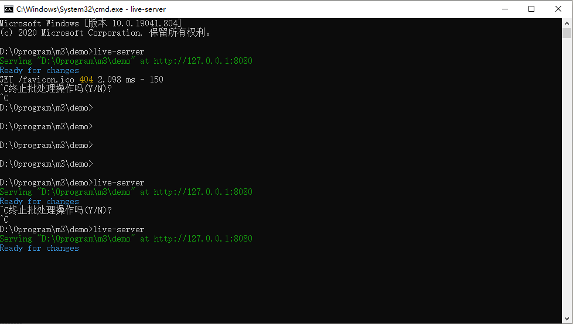

# live-server静态服务器

- 既然我们要前后端分离，所以就需要单独将html代码运行起来。
- 我们如果想脱离浏览器，直接在电脑上通过某个软件就能运行静态文件可以么？
- 这时候我们就需要live-server，等到后边真正部署的时候在用nginx

## 如何安装live-server

> 通过npm安装live-server  

- https://www.cnblogs.com/socket-zhang/p/10620948.html
- npm install -g live-server
- 在静态文件目录下XXX下执行  live-server

> 在VSCode里面安装插件Live Server( https://marketplace.visualstudio.com/items?itemName=ritwickdey.LiveServer )

- https://threejs.org/docs/#manual/en/introduction/How-to-run-things-locally
