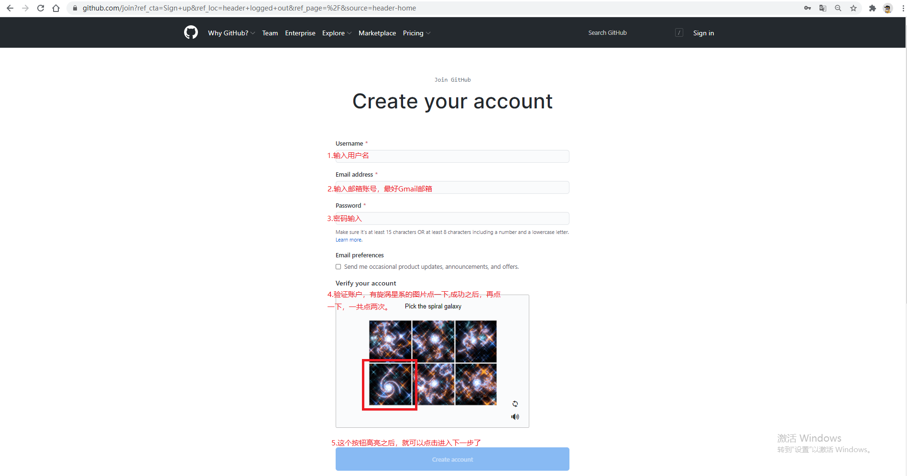
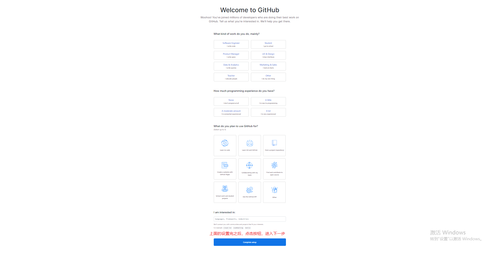
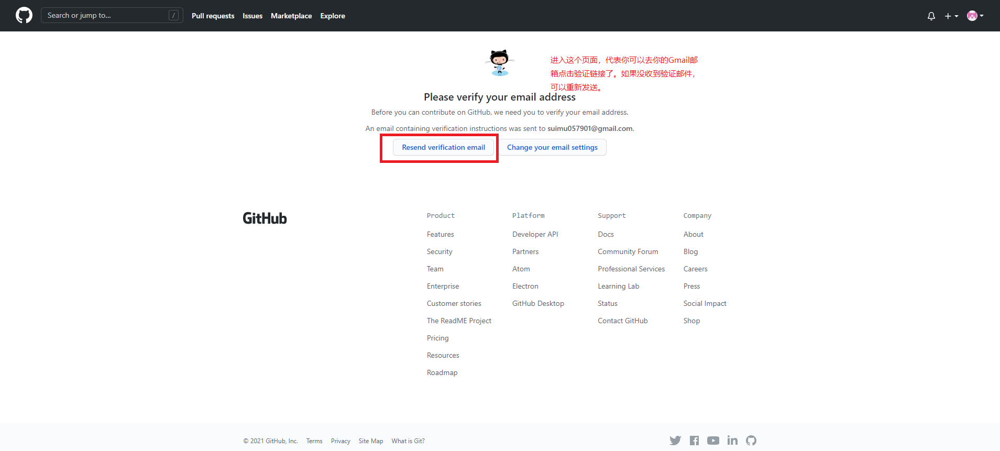
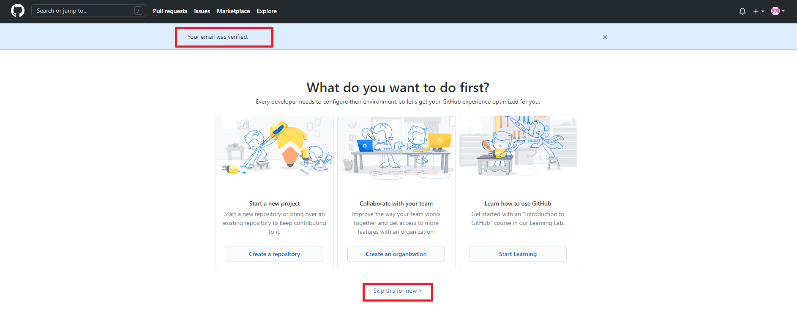
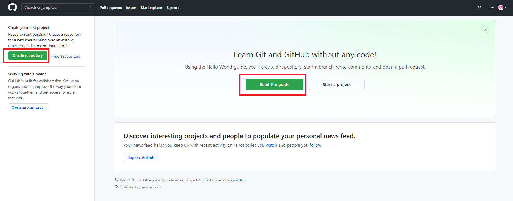
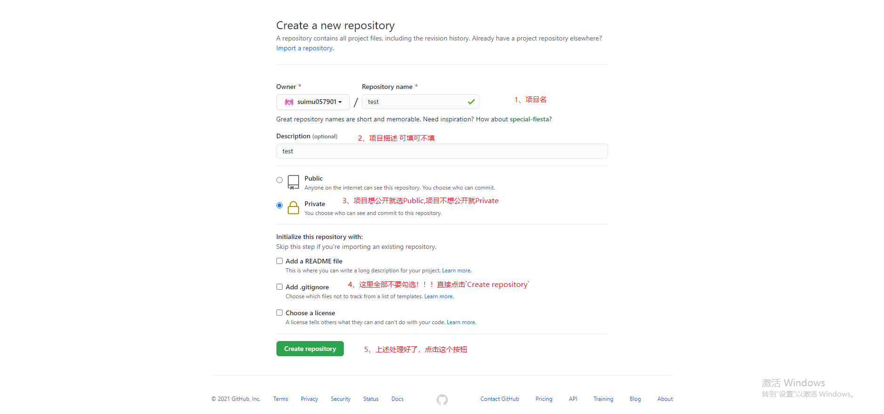
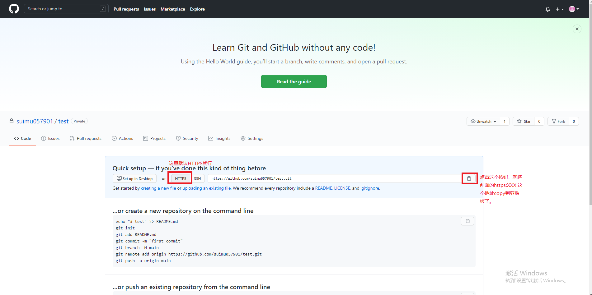
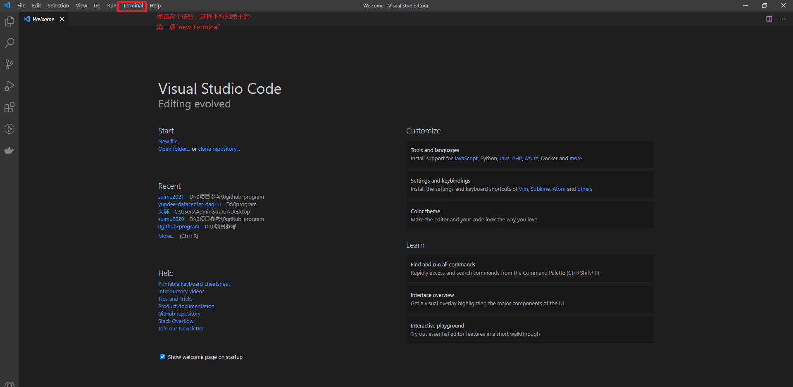

这篇主要讲的是 GitHub 的使用，我将通过图文的形式展现 GitHub 的使用。

**划重点！**，使用 github 最好 kexue 上网(kexue 上网工具教程：https://mp.weixin.qq.com/s/Pc8l-PnEWIYYMr0l9CgxOw )。

<blockquote class="blockquote">为什么要使用GitHub</blockquote>
GitHub( https://www.githubs.cn/post/what-is-github )是一个面向开源及私有软件项目的托管平台，因为只支持 git 作为唯一的版本库格式进行托管，故名 GitHub。

甚至你可以简单粗暴的**把它当作一个笔记本**，用来存储任何东西。把它当作一个笔记本，看着不起眼的几个字，确是我推荐 GitHub 给你的最主要原因！！！

对于程序员来说，GitHub 这个项目托管平台太重要了--不仅仅是由于 GitHub 上面有许多的优秀开源项目可供学习，还因为能在 GitHub 上面构建自己的项目或者技术输出文档。它让我们既能输入又能输出，形成输入输出的闭环，也难怪 GitHub 被称为全球最大的同行社交平台--别废话，用你的作品，用你的产出来社交。

对于非程序员来说，也不用写代码，写技术文档，GitHub 这个平台是不是就没什么用了？还记得我上面说的那句话不--把它当作一个笔记本。你估计还有疑问--市面上的记事本/笔记本这么多，不写代码的我，为什么还有必要用 GitHub 这个平台呢？

- 想必大家都用过`有道云笔记`、`印象笔记`这样的云笔记工具，或者`记事本`、`备忘录`这样的文本记录工具，它们都可以有效的存储我们的图文资料。上述的这些工具，随着存入的资料越来越多，就会变得越来越难以管理了--最终的结果就是那些工具成了`垃圾场`，放在里面的绝大多数内容基本上都不会去看一眼了。想想这样的一种场景吧：工具里面存了几个 G、几十个 G 的学习资料，可是就是没有进去看过几次，这样又有什么什么用呢？不过是增加一点虚幻的自我安慰罢了。
- 而在 GitHub 上面，里面的内容是我们一点一点的的输入进去的，在输入的过程中就凝结了我们自己的思考，很明显，这样的输出质量是只会一股脑的存资料所不能比的。
  - 如果你的这些东西，不想让其他任何人看到，你可以将你的项目设为私密的，这样这个项目里面的所有内容都只有你可见了。
  - 如果你觉得自己写的东西不够好，没关系，先写下来；以后有新思路了再慢慢迭代--就像写代码一样，可以不断的优化你的项目，更难得的是，你的每一次修改或者优化提交，都有相应的提交记录，这样一点一滴的充实和优化你的项目，是一个很有成就感的过程。其实这样一点点的迭代项目，也是符合心理学中"小步子原理"--讲一个大目标分解成小的目标，小到不可能失败的目标，然后这一个个的小目标都有清晰的路径可以实现，这样大目标也能顺利的实现--GitHub 里面的 git 版本管理系统刚好提供了这样的一种方式，让 GitHub 里面的项目不断迭代不断优化。
  - GitHub 里能够很好的支持 markdowm 语法，这样有了 md 格式的话，就能够让我们将注意力完全放在项目内容上，而不是耗时费力的文字格式排版。

<blockquote class="blockquote">怎么注册GitHub账号</blockquote>

- 打开链接( https://github.com/ ), 点击页面右上侧的 `Sign in`按钮
- 进入注册页面，账号、密码、验证账号等等都填上，然后创建账户，截图如下：
  
- 进入设置页面，截图如下：
  
- 进如邮箱验证引导页
  
- 在邮箱里面验证成功，会跳转到验证确认页，截图如下：
  
- 至此，账号创建成功，点击`Skip this for now`按钮，就进入 github 创建项目（仓库）引导页，截图如下：
  

<blockquote class="blockquote">怎么在github里面创建自己的项目？</blockquote>

- 在上图里面，点击`Create repository`按钮，或者点击( https://github.com/new ),就进入创建项目页面了，截图如下：
  
- 在上图中，点击下方的绿色背景按钮，就跳转到项目详情页了，截图所示：
  

<blockquote class="blockquote">怎么上传内容到github上的这个新创建的仓库里面？</blockquote>

- 现在 github 上的仓库已经创建好了，那怎么把内容上传到这个自己新建的仓库里面去？这时候我一般就会用到 Visual Studio Code 编辑器(下载地址是: https://code.visualstudio.com/)。
- 下载完成之后，打开这个编辑器，就是这个界面了。
  
- 然后是下面这个界面，在这个界面里面
  
