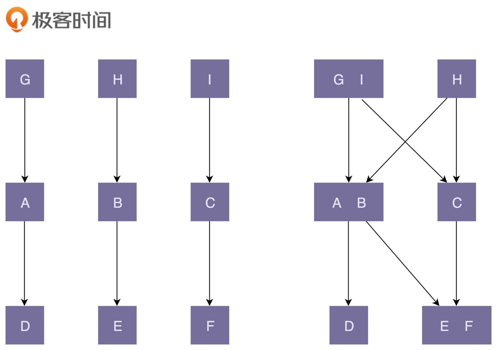

# 设计原则汇总

## 单一职责原则(Single Responsibiliyty Principle)

> 不要大而全的类，要设计粒度小，功能单一的类。
> 如何判断类的职责是否足够单一？ 比较难给类取一个合适的名字
> 类是不是拆分的越细越好呢？如果拆分的过细，降低了代码的内聚性的话，影响了代码的可维护性

## 对扩展开放，对修改关闭(Open Closed Principle)

- 这条原则的设计初衷： 只要它没有破坏原有的代码的正常运行，没有破坏原有的单元测试，我们就可以说，这是一个合格的代码改动。
- 问如何才能做到“对扩展开放、对修改关闭”，也就粗略地等同于在问，如何才能写出扩展性好的代码。
- 为了尽量写出扩展性好的代码，我们要时刻具备扩展意识、抽象意识、封装意识。这些“潜意识”可能比任何开发技巧都重要。

> 对拓展开放是为了应对变化(需求)，对修改关闭是为了保证已有代码的稳定性；最终结果是为了让系统更有弹性！
> 添加一个新功能，应该是在已有代码基础上扩展代码，而不是修改已有代码
> 代码的可扩展性有时会和代码的可读性相违背，所以也不是说 对扩展开放，对修改关闭 就是放之四海而皆准的，很多都是一种权衡。

## 里式替换 LSP(Liskov Substitution Principle)

- 理解里式替换原则，就是理解 design by contract. 按照协议来设计
- 也就是说，父类定义了函数的约定（或者叫做协议），子类可以改变函数内部的实现逻辑，但是不能改变函数的原有约定。

## 接口隔离原则 ISP(Interface Segregation Principle)

- 接口这个概念的理解：接口的调用者不应该强迫依赖它不需要的接口
  - 接口集合（比如某个微服务的接口、某个类库的接口），部分接口只被部分调用者使用，将接口集合拆分。
  - 包含一些功能的单个函数里（一个函数里面有几个不同的方法），部分调用者只需要函数中的部分功能，将函数拆分成细粒度函数。
  - OOP 中的接口，接口的设计尽量单一
- 接口隔离原则和与单一职责原则的区别
  - 接口隔离原则更加侧重于接口的设计
  - 判断接口隔离原则的标准：如果调用者只使用部分接口或接口的部分功能，那接口的设计就不够职责单一。

## 依赖反转原则 DIP(Dependency Inversion Principle)

> 依赖反转原则的定义：

- 高模块不要依赖于低层模块。
- 高层模块和低层模块应该通过抽象来相互依赖
- 抽象不要依赖于具体实现细节，具体实现细节依赖抽象

> 什么是高层模块，什么是低层模块

- 在调用链上，调用者属于高层，被调用者属于低层

> 怎么理解依赖反转原则

- 在业务代码开发中，调用者依赖被调用者，也就是高层模块依赖低层模块是很正常的
- 这条原则主要是用来指导框架层面的设计，这条原则跟控制反转有点类似

## KISS(Keep It Simple and Straightforward) 与 YAGNI（You Ain’t Gonna Need It）

- KISS--是怎么做的问题--尽量保持简单
  - 不要使用同事可能不懂的技术来实现代码，比如正则，有些人确实不太了解正则，而且写的正则容易出现 bug
  - 不要重复造轮子，要善于使用已经有的工具类库
  - 不要过度优化。越是能用简单的方式解决复杂的问题，越是能显示出一个人的能力
- YAGNI--是做不做的问题--不要过度设计，当前不需要的就不要做

## DIY(Don't Repeat Yourself) 不要重复你自己

- 实现逻辑重复，语义不重复，不违反 DIY
- 功能语义重复, 代码逻辑不重复，违反 DIY
- 代码执行重复, 哪怕实现逻辑和语义功能都不重复，也违反了 DIY
  > Rule of Trhree 原则，
- 这里面的'three' 不是真的指的’三‘，在这里指的’第二次‘
- 也就是说，在第一次编写代码的时候，我们不考虑复用性；第二次遇到复杂场景的时候，再进行重构使其复用。

## LOD(Low Of Demeter) 迪米特法则 也叫做最小知识原则 The Least Knowledge Principle

- 高内聚低耦合 VS 低内聚高耦合
- 

> 最小知识原则

- Each unit should have only limited knowledge about other units: only units “closely” related to the current unit. Or: Each unit should only talk to its friends; Don’t talk to strangers.
- 不该有直接依赖关系的类之间，不要有依赖；有依赖关系的类之间，尽量只依赖必要的接口
  - 方法中不要使用 ChainMethods， 不要使用链式调用。Amount = customer.orders().last().totals().amount()
